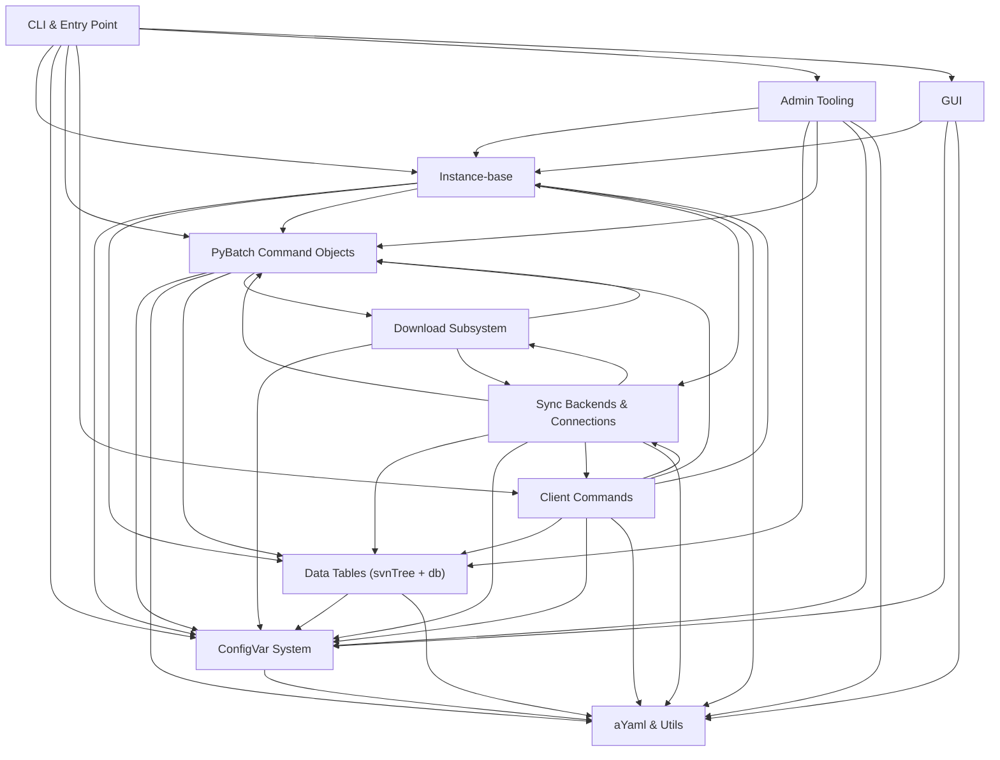
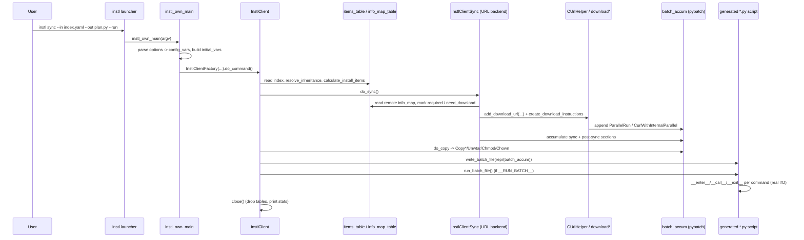

# instl Architecture

> **Modernization status (branch `instl-modernization`).** This document describes instl's
> architecture; some of the god-objects it names have since been **decomposed into packages
> behind thin backwards-compatible shims** (see `docs/REFACTORING.md` → "Modernization status").
> Specifically `pyinstl/instlAdmin.py`, `pyinstl/instlClient.py`, and `pyinstl/instlGui.py` are now
> re-export shims for the `pyinstl/admin/`, `pyinstl/client/`, and `pyinstl/gui/` packages
> (behavior-identical mixin extracts). Public import paths and emitted output are unchanged, so the
> flows and contracts below still hold; only the file layout changed. A typed `config_vars` seam
> (`configVar/accessors.py`) now fronts the hottest OS-identity / input-file keys (Theme 2). These
> deltas are flagged inline below.

## 1. Overview & Purpose

**instl** is a YAML-driven, cross-platform software-deployment / installer engine by Waves Audio. It turns a central, version-controlled description of "what should be installed" (an *index* of install-items plus an *info-map* of every file in the repository) into an ordered, executable plan that downloads, unpacks, copies, permissions, and registers files on an end-user machine — and into the admin tooling that builds and publishes those repositories in the first place.

A defining design choice is that instl rarely acts on the filesystem directly. Instead it **generates a standalone Python "batch" script** (a tree of `pybatch` command objects serialized to eval-able Python source) that performs the same actions when run. This two-phase model (plan → emit script → run script) is the backbone of the whole system.

### Two personas (plus the GUI)

- **Client (end-user)** — runs `instl sync` / `copy` / `synccopy` / `remove` / `uninstall` / `report-*`. The client resolves the install-item dependency graph, marks what must be fetched, downloads files from the remote repository (typically S3 via curl), copies/unwtars them into place, runs pre/post actions, and rewrites the site `require.yaml`. Implemented by `InstlClient` and subclasses.
- **Admin (Waves engineer / CI)** — runs `instl admin <subcommand>`: SVN/staging maintenance, info-map and index verification, building per-repo-rev artifacts and uploading them to S3 (`up2s3` / `up-short-index`), activating a repo-rev, and a long-running Redis-triggered upload daemon. Implemented by the `InstlAdmin` god-class. Admin mode is only available when **not** frozen (running from source).
- **GUI** — a Tk/ttk desktop front-end (`InstlGui`) with Client, Admin, and Activate tabs. It does **not** execute instl logic in-process; each tab builds an instl command line from config-vars and spawns the instl executable as a subprocess. The Activate tab additionally talks directly to Redis.

There is also a **doit** mode (`InstlDoIt`, a dependency-ordered generic action runner) and a **do_something** / **misc** mode (`InstlMisc`, a grab-bag of standalone utilities such as `wtar`/`unwtar`/`checksum`/`ls`/`check-checksum`).

### Relationship to Waves Central

instl's primary (and, in production, only) consumer is **Waves Central**, the Electron desktop app that installs/repairs/updates/removes Waves plug-ins and apps. From Central's vantage point instl is the **embedded install engine**: Central never reimplements install logic — it shells out to the bundled `instl` binary as a black-box CLI. (Confirmed by Central's own docs: "*Instl* - in-house solution for install/repair/update/remove plugins and apps", `Central project structure.md`.)

- **How it ships.** The "latest" engine is built from this instl repo (currently branch `download-enhancements`) by running instl on itself — `instl doit --in Build-index.yaml --out build-instl.py --run --no-system-log` — which drives PyInstaller via `instl.spec` to produce an **onedir `instl.bundle`** (Central `build_instl/build_instl.sh`, `build_instl.py`). On Mac the bundle is signed with `codesign` (hardened runtime, timestamp, entitlements) per-file then bundle-wide, and on universal builds is re-signed/injected *after* the app is signed (`sign_instl.py`, `tasks/afterSign.js`). At runtime the bundle lives at `…/Waves Central.app/Contents/Resources/res/external/bin/instl.bundle/Contents/MacOS/instl` (Windows: `…/Win64/instl.exe`). Two checked-in **legacy** engines `instl-V9` / `instl-V10` ship alongside it under `…/bin/`; Central picks the engine per-repository (latest vs legacy V9) and forbids online actions on non-latest engines (`src/services/instl/behaviours/shell/common.tsx`).
- **How it is invoked.** Central's `ShellInstl` behaviour (the Strategy-pattern wrapper behind `instlWrapper`) builds command lines of the form `"<instl>" <command> --in "<in>.yaml" --out "<out>.py" --log "<buffer>" --run`, mapping Central operations to instl subcommands: `onlineInstall → synccopy`, `createInstallerSync → sync`, `createInstallerCopy`/`offlineInstall → copy`, `uninstall → uninstall`, `reportVersions → report-versions`, and version-organizer/permission-fixer/cleanup/etc. → `doit` (or `exec --config-file` for the version organizer). Note two deviations from the generic form, confirmed in Central source: **`report-versions` does NOT take `--run`** (it emits JSON directly — see flow note below), and **`exec --config-file <locations.yaml>`** runs an in-process pybatch script (`organizer.py`, `reportVersions.py`) without `--run`.
- **Online access params.** For online actions Central injects access params into the input YAML: `BASE_LINKS_URL`, `COOKIE_JAR` (CloudFront key-pair/policy/signature), and `REPO_REV_EXT` (`src/services/instl/.../instlYaml.tsx`).
- **Elevation & cancellation.** Elevation is owned by **Central**, not by an instl "admin persona": admin/live runs wrap the emitted command in an `.irl` run-list and call `"<instl>" run-process --abort-file "<.abort>" --in "<.irl>"`; cancellation deletes the `.abort` file (which instl watches), and on Catalina+ Mac elevation uses the `InstlHelperApplication` helper rather than `sudo`. The new download UX additionally drives **pause/resume/try-now** over instl `run-process` **stdin** as one-line JSON `{cmd, sessionId}` (matches the control channel in flow (c)).

> Note: instl's **admin** and **GUI** personas (below) are *not* used by Central — Central drives only the client/CLI surface plus `doit`/`exec`/`run-process`. The admin/GUI personas are exercised by Waves CI and engineers.

---

## 2. Layered Architecture

instl is best understood as a stack of layers, top (closest to the user) to bottom (foundational I/O):

### Entry / CLI layer
The `instl` launcher script reopens stdout/stderr as UTF-8 and calls `instl_own_main(argv)`. `instl_own_main` runs inside an `InvocationReporter` context manager (which owns top-level logging, timing, and exception suppression), fixes SSL paths, injects the truststore, parses the command line, builds the ~40-key `initial_vars` dict, and `match`-dispatches on `(mode, is_compiled)` to the correct command instance. `CommandLineOptions` / `OptionToConfigVar` parse argv straight into the global config-vars singleton. `command-list` mode (`CommandListRunner`) reads a file of instl command lines and runs them serially or via `os.fork`.

### Instance / configuration layer
`InstlInstanceBase` (abstract, `abc.ABCMeta`) is the inheritance root for **all** command objects (`InstlClient`, `InstlAdmin`, `InstlMisc`, `InstlDoIt`, `InstlGui`). It owns shared state and lifecycle: loading defaults and user config YAML into config-vars, registering YAML tag handlers (`!define`, `!include`, `!index`, `!require`), the `batch_accum` (PythonBatchCommandAccum), the SQLite DB lifecycle, cache/sync dir resolution, batch-file writing/running, dependency-graph queries, and require/config serialization. The interactive REPL (`CMDObj`, `go_interactive`) lives alongside it.

### Command logic layer
The command-specific subsystems that decide *what* to do:
- **Client commands** (`InstlClient` + `InstlClientCopy` / `Remove` / `Uninstall` / `Report`, and the inline `InstlClientSyncCopy`) — the end-user install workflow.
- **Sync backends & connections** (`InstlClientSync`, `InstlInstanceSync` + URL / SVN / P4 / boto backends, `connectionBase`) — how files are fetched.
- **Admin tooling** (`InstlAdmin`) — repository build/maintenance/publish.
- **DoIt / Misc** — generic action runner and utilities.

These layers emit work into `batch_accum` rather than performing it.

### PyBatch execution layer
`pybatch` is instl's object model for deployment actions. Every step (copy, remove, download, wtar, chmod, svn, registry, symlink, conditional, subprocess) is a `PythonBatchCommandBase` subclass with a dual identity: it **executes** at runtime (`__enter__`/`__call__`/`__exit__`) and its **`__repr__` emits eval-able Python source**, so the whole plan can be serialized to a `*-sync.py` / `*-copy.py` script and re-run later. `PythonBatchCommandAccum` groups commands into ordered sections and renders the entire script. The curl drivers (`ParallelRun`, `CurlWithInternalParallel`) live here too.

### Data / I/O foundation layers
- **ConfigVar system** — the `config_vars` global `ConfigVarStack`: multi-valued, lazily-resolved variables with a `$(NAME<params>[index])` resolution mini-language, scoped dict stack, and a YAML reader (`ConfigVarYamlReader`).
- **aYaml & utils** — augmented-YAML reading/writing on top of PyYAML, plus the shared toolkit (file/URL I/O with checksum caching, OS/arch detection, checksums, parallel subprocess execution, multi-file streaming for split wtars, ls, logging, email).
- **Data tables (db + svnTree)** — the single shared SQLite database modeling the install: `svn_item_t` (info-map / file table), `index_item_t` + `index_item_detail_t` (install-items with resolved inheritance), and auxiliary tables. `DBManager` exposes the shared singletons.
- **Download subsystem** — the curl-based bulk download engine: config-file generation (`CUrlHelper`), failure classification and retry (`downloadFailures` / `downloadRetry`), cooperative pause/resume/try-now control channel (`downloadControlChannel`), persisted per-session/per-file state and resume sidecars (`downloadState`), throughput/error sampling (`downloadObservability`), between-session concurrency recommendation (`downloadConcurrency`), structured event telemetry (`downloadEvents`), and rollout cohorts (`downloadCohort`).

---

## 3. Module Dependency Overview

The diagram below renders the principal `depends_on` relationships between subsystems (arrows point from a subsystem to what it depends on). Foundation layers (config-vars, aYaml/utils, data tables) are sinks; the CLI entry point is the source.

A few relationships are intentionally bidirectional/cyclic in the maps and worth calling out:
- **Sync ↔ Client**: `InstlClientSync` is itself a client subclass, while the sync backends call back into the `InstlClient` instance (`instlObj`) for sync-location computation and the shared `batch_accum`.
- **PyBatch ↔ Download**: `CheckDownloadFolderChecksum` (a pybatch command) is the de-facto in-process redownload/retry orchestrator and imports the entire `download*` family; the download subsystem in turn emits pybatch curl commands.

---

## 4. Core Runtime Flows

### (a) Client install / sync / copy run

1. `instl` launcher reopens stdout/stderr as UTF-8 → `instl_own_main` enters `InvocationReporter`, fixes SSL, injects truststore.
2. `read_command_line_options` parses argv; `OptionToConfigVar` descriptors write straight into the global `config_vars`. `initial_vars` is assembled and `InstlClientFactory(initial_vars, command)` constructs the right client subclass.
3. `init_from_cmd_line_options` copies remaining options (`--define`, which-revision, etc.) into config-vars and decides DB refresh.
4. `do_command()` runs the pipeline: activate target OSes → read the main YAML index (via `connection_factory`) into `items_table` → `check_version_compatibility` → `init_default_client_vars` → `resolve_inheritance` → `calculate_install_items` (marks per-IID `install_status` in the DB and computes `__FULL_LIST_OF_INSTALL_TARGETS__` etc.).
5. For **sync**: `do_sync` selects a backend by `REPO_TYPE` (default URL). The URL backend downloads the remote info-map into `info_map_table`, marks required/to-download items, and feeds download URLs to `CUrlHelper` (see flow c). Work is accumulated into `batch_accum` sections (sync / post-sync); `NEW_HAVE_INFO_MAP_PATH` is copied to `HAVE_INFO_MAP_PATH`.
6. For **copy**: `do_copy` reads the have-info-map, sorts items by target folder, and per folder/IID emits `Copy*` / `Unwtar` / `Chmod` / `Chown` commands plus pre/post-copy actions and the require-file update.
7. `command_output()` serializes `batch_accum` to the batch `.py` file (`__MAIN_OUT_FILE__`), dumps config-vars, and — if `__RUN_BATCH__` is set — runs it.
8. The generated script re-imports `pybatch` and executes each command through `__enter__`/`__call__`/`__exit__`, performing the real filesystem work.
9. `close()` tears down the tables/DB and prints config-var statistics.

> The emit→run split is confirmed by Central, which invokes the latest engine as `"<instl>" <command> --in … --out <out>.py --log … --run` and lets `--run` execute the emitted `.py` pybatch script (`baseInstlAction.tsx`). Two subcommands break this pattern: `report-versions` emits JSON directly and is invoked **without** `--run` (Central comment: "`--run` doesn't work on report-versions"), and `exec --config-file` runs an in-process script (e.g. `organizer.py`) without `--run`. Legacy `instl-V9`/`instl-V10` do not support `--log`; Central redirects their output with `>> <buffer> 2>&1` instead.

### (b) Admin repo-build / up-to-s3 run

1. `instl admin up2s3 --config-file ... --run` (typically from CI). `instl_own_main` dispatches to `InstlAdmin(initial_vars)` (allowed only when not frozen).
2. `do_command()` dynamically dispatches via `getattr(self, 'do_' + fixed_command)()`; config is read from `defaults/InstlAdmin.yaml` plus `--config-file` YAMLs into scoped `config_vars`.
3. `do_up2s3` / `up2s3_repo_rev` asserts the repo-rev passes BASE/IGNORE thresholds, sets `UP2S3_STATUS`, and accumulates pybatch commands: `SVNCheckout` → `SVNInfo`/`SVNPropList`/`FileSizes` → `IndexYamlReader`/`SVNInfoReader` (load into the DB) → `InfoMapFullWriter`/`InfoMapSplitWriter` → `Wzip` index → `ShortIndexYamlCreator` → `CreateRepoRevFile`.
4. A `Subprocess` `aws s3 sync` uploads the per-repo-rev folder (info-map `.info`/`.props`/`.file-sizes`, full+split info maps, wzipped index, short-index, repo-rev file) to the S3 bucket.
5. On completion the run records state in Redis and, in a `finally` block, emails a report from a template (`send_email_from_template_file`); exceptions set `UP2S3_EXCEPTION` and re-raise.
6. The **wait-on-action-trigger** daemon variant `BRPOP`s a Redis waiting list, parses `upload|activate|short-index:domain:major:repo-rev` triggers, writes a per-trigger config YAML, and spawns a fresh instl process (`multiprocessing` spawn → `instl_own_main`) to run the actual command, while a heartbeat thread keeps a Redis key alive.

### (c) Bulk download run (download subsystem)

1. **Planning** (`InstlInstanceSync_url`): for each file, `downloadState.resume_decision_for_download_item` reads the `.part` size, the per-file sidecar (`files/{file_id}.json`), and the signed-URL TTL to decide `resume_from_byte` / conditional headers. `CUrlHelper.add_download_url(...)` accumulates a `CurlDownloadEntry`.
2. `create_download_instructions` partitions fresh vs resume entries into phases, writes curl config files (with `continue-at`, no-fail, retry / offline-grace lines), a `.parallel-run` file, and appends a `ParallelRun` or `CurlWithInternalParallel` pybatch command. Between-run `PARALLEL_SYNC` is recommended by `downloadConcurrency.resolve_concurrency_from_config` from the previous `session-summary.json`.
3. **Execution** (pybatch curl drivers): curl runs. On `PAUSED_EXIT_CODE` or a network-class exit code, the driver consults the stdin control-channel singleton (`downloadControlChannel.wait_if_paused` / `sleep_or_wake` with a bounded backoff budget) and resumes from the `.part` file; on exit 33 it runs the fresh-restart fallback config.
4. **Verification / redownload** (`CheckDownloadFolderChecksum`): each downloaded file's checksum is compared against the info-map DB. Failures are classified (`downloadFailures`), retries decided (`downloadRetry.decide_retry`) with try-now-aware `sleep_backoff`, verified temp files promoted (`promote_verified_temp_file`), outcomes recorded into the observability singleton, and structured `DOWNLOAD_EVENT` lines emitted to Central.
5. **Cross-run channel**: `end_session` writes `session-summary.json` under `<bookkeeping>/download-state`; the next run reads it to adapt concurrency. Persisted state: `session.json`, per-file sidecars, `.part` temp artifacts, and the summary.

> Central side (confirmed): instl runs under `run-process` and Central writes `{cmd:"pause"|"resume"|"try_now", sessionId}` one-line JSON to instl **stdin** to drive the control channel; `DOWNLOAD_EVENT <json>` (and the legacy `DOWNLOAD_RETRY_DECISION <json>`) lines are parsed by Central's progress handler. Pause is cooperative — it gates *between* curl batches and does not kill in-flight curl; the hard-cancel path remains `run-process --abort-file`. Offline-grace auto-pause/resume is currently detected **client-side in Central** (`navigator.onLine` + a network-failure streak heuristic), not yet emitted by instl as `paused, reason="offline"`.

---

## 5. Key Cross-Cutting Concerns

### Configuration variables and `$()` resolution
A single process-wide `config_vars` (`ConfigVarStack`) is the source of truth for runtime settings. Each `ConfigVar` holds zero-or-more raw string values; resolution is **lazy** and on-demand through a hand-written state-machine parser (`var_parse_imp`) implementing the `$(NAME<params>[index])` mini-language. The stack is scoped: `__setitem__` writes the top level, lookups scan inner→outer so inner scopes shadow. Resolving a parameterized reference temporarily pushes a scope, injects `__NAME_n__`/keyword temp vars, slices by array range, and pops. A fast path bypasses the parser when no `$` is present. Definitions are loaded from YAML by `ConfigVarYamlReader` (supporting `!define`, `__include__`, `__environment__`, conditionals, and the `!+=` append tag). This global is read and mutated by ~50 modules — the dominant cross-cutting coupling in the codebase.

### The pybatch command / serialization model
Every deployment action is a `PythonBatchCommandBase` subclass declared via `__init_subclass__` flags (`essential`, `call__call__`, `is_context_manager`, `is_anonymous`, `kwargs_defaults`). The same object both runs (context-manager + `__call__`) and serializes (`__repr__` emits eval-able source; `repr_own_args` plus the `named/unnamed/optional_named__init__param` machinery build it). `PythonBatchCommandAccum.__repr__` walks the command tree, wraps non-special sections in a `PythonBatchRuntime`, and emits the full script with imports, progress globals, and a `.timings.py` twin. Index-YAML action strings become commands via `EvalShellCommand` (which `eval`s the string into a command, falling back to `ShellCommand`). This repr→eval round-trip is powerful but requires `__init__`/`__repr__` to stay in perfect sync and is security-sensitive.

### Persistence (SQLite + on-disk state)
- **SQLite** — one shared DB (`:memory:` by default, or a file) owned by `DBMaster` and exposed via `DBManager`'s lazy descriptors (`db`, `info_map_table`, `items_table`). DDL is loaded from `defaults/*.ddl`. `svn_item_t` models the info-map; `index_item_t` + `index_item_detail_t` model install-items with resolved inheritance; auxiliary tables track active OSes, config vars, GUID↔IID bridges, and require-translation. Heavy set-based SQL does mark-required, mark-need-download, inheritance resolution, and sync-folder diffing.
- **On-disk** — the generated batch `.py` script (+ timings twin), bookkeeping info-map text files (`NEW/REQUIRED/TO_SYNC/HAVE_INFO_MAP`), `require.yaml` lifecycle files, download-state under `<bookkeeping>/download-state` (`session.json`, per-file sidecars, `.part` temp files, `session-summary.json`), cached downloads keyed by checksum/url, logs under appdirs, and the readline history file.
- **External** — S3 (repo-rev folders) and Redis (done-lists, status keys, heartbeat, waiting list) for the admin pipeline.

### Platform abstraction (Mac / Win / POSIX)
Platform handling is pervasive and currently **scattered** rather than centralized. The CLI/instance layers branch on `os_family_name` and `sys.frozen` for path/launch resolution; `pybatch` selects platform-specific command classes at import time (`POSIXBatchCommands`, Mac `MacDock`, Win `WinShortcut`/registry/`ResHacker`, with Win classes aliased to dummies elsewhere) and branches hard on `sys.platform` inside `Chmod`/`Chown`/`ChFlags`; `configVar` rewrites `$(X)` to `%X%`/`${X}` per OS and lowercases env keys on Windows; `utils` dispatches ls/extract-info/file-lock per OS; the download/curl helper has Windows short-path workarounds.

### Concurrency
- **Download parallelism** — curl's internal `--parallel` (`CurlWithInternalParallel`) or instl's `ParallelRun` via `ThreadPoolExecutor`, partitioned on `wait` sentinels, with SIGTERM-based termination so curl flushes `.part` files for resume.
- **Cooperative control** — a daemon stdin reader (`DownloadControlChannel`, a module singleton) drives pause/resume/try-now and offline-hold across the curl drivers and the retry sleeper.
- **Process-level** — `command-list` mode forks children (`os.fork`/`os.waitpid`); the admin daemon spawns fresh instl processes via `multiprocessing` (spawn) per trigger.
- **Caveat** — much run-scoped state is class-level/global (pybatch progress + stage stack, `config_vars`, parallel-run module globals), so the model is **not** reentrant or thread-safe in the general case.

---

## 6. Architectural Pain Points & Refactoring Themes

The per-subsystem reviews converge on a small number of recurring, high-impact themes. Prioritized:

### Theme 1 — God-objects / mixed concerns (highest impact)
The largest, most-coupled classes each bundle many unrelated responsibilities:
- `InstlInstanceBase` — config loading, YAML tag reading, DB lifecycle, cache/sync paths, batch-file generation *and* execution, dependency-graph queries, serialization. It is the root of all five command subclasses, so every concern is forced onto every command.
- `InstlClient` (~660 lines) — pipeline orchestration, DB status mutation, target-folder bookkeeping, sync-location computation, require.yaml I/O, binary-version scanning, YAML representation. *(Now extracted into the `pyinstl/client/` mixin package behind a shim; the deeper collaborator split — `InstallPlan` etc. — is still pending.)*
- `InstlAdmin` (~1480 lines) — ~10 distinct command clusters (svn-fix, stage-sync, wtar, verify, up2s3, activate, redis-daemon, manifests, misc) in one class with `getattr`-based dispatch. *(Now extracted into the `pyinstl/admin/` mixin package behind a shim; the named command-cluster collaborators are still pending.)*
- `PythonBatchCommandBase` — execution + serialization + progress + stage stack + timing + error-report + tree-building + hashing.
- `SVNTable` (~1600 lines) and `IndexItemsTable` — parsing + bulk insert + dozens of query helpers + mutation + URL policy + reporting.
- `ConfigVarStack` and `FrameController` similarly mix container/resolver/serializer and UI/process/error-parsing concerns. *(`FrameController` and the GUI now live in the `pyinstl/gui/` package — `gui/_frame_base.py` — behind a shim; `ConfigVarStack` is unchanged.)*

**Direction:** extract cohesive collaborators (e.g. PathResolver, BatchFileWriter, DependencyAnalyzer; SVNReader/Query/Mutator; IndexYamlReader/InheritanceResolver/Query; serialize vs execute mixins) and keep the base classes thin shells.

### Theme 2 — Global mutable singletons / hidden coupling (high impact)
Process-wide mutable state is everywhere: `config_vars` (mutated by ~50 modules and by option-parsing side-effects), `DBManager`'s class-level table descriptors, `ConnectionBase.repo_connection`, the download module singletons (control channel, observability, telemetry flag, curl-parallel cache), pybatch's class-level progress/stage state, and `utils` module globals (acting uid/gid, parallel-run state, doing-stack). This makes parsing non-idempotent, tests dependent on `reset_*`/`clear()` hooks, and the runtime non-reentrant/thread-unsafe.

**Direction:** thread explicit context/session objects through the choke points and inject dependencies (config stack, DB, connection) rather than reaching for globals; keep singletons as thin defaults.

> *Modernization delta:* a first containment increment landed — `configVar/accessors.py` provides
> typed, documented accessors (`current_os`, `target_os`, `main_input_file_path/str`, `run_batch`,
> `repo_rev`, …) over the hottest read keys, each taking an optional `cv` parameter so a future
> injected stack can be threaded in without touching call sites. The global singleton itself is
> unchanged; DB/connection/download-context injection remains future work (download half POC-gated).

### Theme 3 — `eval`/`exec` on supplied input & repr→eval serialization (high impact)
The plan is shipped as Python source and `eval`'d (`EvalShellCommand`, `If.__call__`, `batch_accum.__repr__`); config `__if__` conditions are `eval`'d (`eval_conditional`, with `os`/`sys` imported solely for reachability); `do_python` is an unguarded `eval`; `run_batch_file` can `exec` into the host globals; `send_email_from_template_file` `eval`s a template. This couples every command's `__init__`/`__repr__`, is hard to sandbox/test, and is a security surface.

**Direction:** introduce a structured (dataclass/JSON) intermediate representation with a registry-based deserializer; restrict `EvalShellCommand` to a whitelist; replace config-condition `eval` with `ast.literal_eval`/a safe evaluator; run generated scripts uniformly in a subprocess.

### Theme 4 — Scattered, duplicated platform branching (medium impact)
"Where am I installed / how do I act per-OS" logic is smeared across many helpers (`instl_main` path resolvers, `configVar` env + native-pattern rewriting, pybatch `Chmod`/`Chown`/`ChFlags` and import-time class selection, `utils` ls/extract/lock, GUI `setsid`/`startfile`, curl short-path). OS detection is re-derived in multiple files; identical Mac/Linux branches invite drift.

**Direction:** centralize OS/runtime detection in one place (a `RuntimeLayout`/platform-policy object) and use per-OS strategy objects (PermissionBackend, FlagBackend) injected by platform.

### Theme 5 — Duplicated logic & near-duplicate code paths (medium impact)
Repeated implementations create divergence risk: the pause/offline/network-retry/exit-33-fallback loop is copy-pasted across `ParallelRun` and `CurlWithInternalParallel`; the `_DISALLOWED_EVENT_FIELDS` denylist and config-var accessor helpers are duplicated across download modules; `up2s3_repo_rev` vs `up_short_index_repo_rev` share upload scaffolding; uninstall has two reference-counting algorithms (one dead); the `get_*details*` query family repeats SELECT boilerplate ~10 times; atomic-JSON-write and UTC-timestamp helpers are reimplemented several times; `read_*_config_files`, subprocess-spawn, and copy logic (`CopyDirToDirEx` vs `RsyncClone`) are duplicated.

**Direction:** extract shared helpers/context-managers (a CurlRunLoop, a single denylist, a parametrized detail-query builder, one atomic-write/timestamp utility, a common `run_instl_subprocess`).

> ⚠️ Sequencing caveat: the curl-loop, download-module denylist, and atomic-JSON-write duplications listed above sit inside the `download*` subsystem that the **active Download System Enhancement POC** is currently building (Central branch driving instl `download-enhancements`). Consolidating them now would collide with in-flight POC work and the telemetry kill-switch / dual emission paths (`DOWNLOAD_EVENT` + legacy `DOWNLOAD_RETRY_DECISION`, whose separate redaction is intentional). These consolidations should be sequenced **after** the POC stabilizes/merges — see `docs/REFACTORING.md` (W2/W3/W7). Human decision required on timing.

### Theme 6 — Dead code, swallowed exceptions, and latent bugs (medium impact)
Pervasive `if False:` blocks, no-op stubs (`text_with_color`, `teardown_file_logging` unreachable body), dead helpers (`find_leaves`, `can_skip_unwtar`, `_option_1`), always-false debug flags, and commented-out blocks add noise. Broad `except: pass` swallowing hides failures in `should_wtar`, `do_translate_guids`, `extract_info`, the heartbeat thread, and GUI activate/upload. Concrete latent bugs flagged: `verbatim=source_url==['url']` (always False), the P4 command-string quoting, `SVNRow.__eq__` omitting a column and a broken `__repr__` f-string, `RmGlob` `log.wanging` typo, a missing-`f` f-string in `baseClasses`, `IsSymlink` defining `repr_own_args` instead of `__repr__`, broken hand-rolled transaction nesting in `DBMaster` (swallowing `OperationalError`), `get_disk_free_space` referencing an unimported `win32file`, and the vendored `dockutil` using `plistlib` APIs removed in Python 3.9+.

**Direction:** delete dead code, narrow exception handling and log instead of `pass`, and fix the enumerated bugs (each is small but several are correctness-affecting).

> *Modernization delta:* the dead-code / narrowed-`except` hygiene pass has **landed** across the
> pybatch, configVar/aYaml, utils, db/svnTree, and pyinstl-core packages, and the latent bugs
> surfaced by the new characterization goldens (e.g. `SVNRow.__eq__`/`__repr__`) are fixed. The
> remaining off-happy-path items fold into their structural workstreams (see `docs/REFACTORING.md`).
