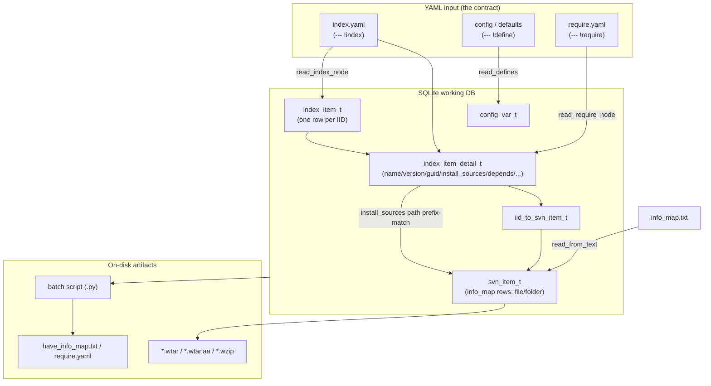

# instl Domain & Input-Contract Reference

This document describes **what `instl` consumes** — the YAML formats, the `$()` configuration-variable language, the install-item model, and the persistence formats that together constitute the tool's external contract. A refactor of the internals must preserve everything documented here, because index files, config files, `info_map` files, `require.yaml`, and the on-disk batch/archive artifacts are produced and consumed by other systems (notably Waves Central) and by previously-generated installations in the field.

`instl` is a YAML-driven, cross-platform software-deployment tool. It does not itself download or copy files at the moment it runs; instead it **reads declarative input** (an index of installable items plus configuration), resolves it against a SQLite working database, and **emits a batch script** (Python-batch, file extension `py`) that, when run, performs the actual sync/copy/remove work.

---

## 1. Conceptual Model

### Core domain objects

- **The index** — a YAML document (`index.yaml`, tagged `--- !index`) that is the catalog of every installable thing. Each top-level key is an **IID**; its value is the item definition.
- **Install item / IID** — one installable unit. `IID` is the *Install Item ID*, the unique string key under which an item appears in the index (e.g. `WaveShell_VST3`). An item carries fields like `name`, `guid`, `version`, `install_sources`, `install_folders`, `depends`, `inherit`, and lifecycle `actions`.
- **info_map** — a flat manifest of every file/folder in the repository at a given repo-rev: path, flags, revision, checksum, size, and optionally a download URL. It is what tells `instl` which concrete bytes back an `install_sources` path. Stored as `info_map.txt` (text) and loaded into the `svn_item_t` table.
- **svnTree / `svn_item_t`** — the in-memory/DB representation of the info_map (see glossary for the historical name). One row per file or folder.
- **Client vs Admin world** — two operating modes:
  - **Client** (`InstlClient*`: `sync`, `copy`, `synccopy`, `remove`, `uninstall`, `report-versions`, …) runs on an end-user machine. It reads the index + a user config, figures out which items/files are required, and emits a batch to **sync** (download) and **copy** (install) them.
  - **Admin** (`InstlAdmin`: `stage2svn`, `svn2stage`, `up2s3`, `collect-manifests`, `fix-perm`, `wtar`, `trans`, …) runs on the deployment side. It builds the repository, produces the index and info_map, wtars large items, and uploads to S3.
- **The config-var stack** — the global `$()` variable namespace (`ConfigVarStack`) shared by all parts of `instl`, seeded from `initial_vars`, the bundled `defaults/*.yaml`, and the user's config file.

### Relationships



An IID's `install_sources` are **repository paths**; those paths are matched (by prefix) against `svn_item_t` rows to determine the concrete files to download and copy. `depends` link IIDs to other IIDs. `inherit` links an IID to parent IIDs whose details it absorbs.

---

## 2. The YAML Input Formats

`instl` uses an **augmented YAML** layer (`aYaml/`) on top of PyYAML. A single physical file may contain **multiple YAML documents** (separated by `---`), and each document's **tag** selects which reader handles it. The base machinery is in `aYaml/yamlReader.py`; the config-var documents are handled by `configVar/configVarYamlReader.py`.

### 2.1 Document dispatch by tag

`YamlReader` composes all documents in a stream and, for each, calls `get_read_function_for_doc`:

- An **untagged** document maps to the meta-tag `__no_tag__`.
- A document whose tag is not registered maps to `__unknown_tag__`.
- A tag ending in **`_post`** (e.g. `!define_post`) is deferred: the document is queued and read only **after all files finish reading** (`self.post_nodes`). This is how late-bound definitions are layered on top of everything else.
- `ACCEPTABLE_YAML_DOC_TAGS` (defined in `main.yaml`) registers additional OS-specific document tags such as `define_$(__CURRENT_OS__)`, so e.g. `--- !define_Mac` / `--- !define_Win` are read only on the matching OS.

`convert_standard_tags` normalizes YAML nulls (`tag:yaml.org,2002:null`, `python/none`) to Python `None`.

### 2.2 Config / define documents

Handled by `ConfigVarYamlReader.read_defines`. Registered document readers:

| Document tag | Reader | Meaning |
|---|---|---|
| `--- !define` | `read_defines` | Define config vars (the normal case). |
| (untagged, `__no_tag__`) | `read_defines` | Same as `!define`. |
| `--- !define_const` | `read_defines` | **Deprecated**; read identically to `!define` (it is *not* actually constant anymore — see glossary). |
| `--- !define_if_not_exist` | `read_defines_if_not_exist` | Define each var **only if it is not already defined**. Cannot contain `__include__`. |
| `--- !define_<OS>` / `--- !define_if_not_exist_<OS>` | (via `ACCEPTABLE_YAML_DOC_TAGS`) | OS-gated define, e.g. `!define_Win`. |
| unknown tag | `do_nothing_node_reader` | Silently ignored. |

Within a `!define` document, a mapping key is normally a config-var name and its value (a scalar or a sequence) becomes the var's value list. Several **special keys** are recognized inside the document body:

| Key | Effect |
|---|---|
| `__include__` | Read another YAML file (value resolved with `$()` first). The value may be a **scalar path**, a **sequence of paths**, or a **mapping** (`{url:, checksum:, copy:}`) — see below. |
| `__include_if_exist__` | Like `__include__` but missing files are ignored (`ignore_if_not_exist`). |
| `__environment__` | Import the listed names from the OS environment into config vars. |
| `__if__(expr)` | Conditional block: `eval()` the resolved `expr`; if truthy, read the block's defines. |
| `__ifdef__(VAR)` | Read the block only if `VAR` is currently defined. |
| `__ifndef__(VAR)` | Read the block only if `VAR` is **not** defined. |

Conditionals are parsed by `conditional_re` (`__if<type>__(condition)`) and dispatched in `eval_conditional`.

> **`__include__` map form (remote fetch-then-cache).** `read_include_node` (`pyinstl/instlInstanceBase.py:271`) accepts not just scalar/sequence paths but also a **mapping** with keys `url:`, optional `checksum:`, and optional `copy:`. It downloads the file from the (resolved) `url` into the aux cache (verifying `checksum` via `download_from_file_or_url`), reads it as YAML, then — if `copy:` is present — emits `MakeDir` + `CopyFileToFile` batch commands (in the `post` section) to cache the fetched file to each `copy` destination (skipping a destination whose existing checksum already matches). This is how the index itself is loaded in production. Note the simpler `ConfigVarYamlReader.read_include_node` (`configVar/configVarYamlReader.py:124`) handles only scalar/sequence; the map form is added by the `InstlInstanceBase` override.
>
> Real-world example — `V10-online-common.yaml` (Waves Central data), inside a `--- !define` document:
> ```yaml
> __include__:
>     url:  $(BASE_LINKS_URL)/admin/$(REPO_NAME)_repo_rev.yaml$(REPO_REV_EXT)
>     copy: $(LOCAL_REPO_BOOKKEEPING_DIR)/$(REPO_NAME)_repo_rev.yaml
> __include__:
>     url: $(INDEX_URL)
>     checksum: $(INDEX_CHECKSUM)
>     copy:
>         - $(LOCAL_REPO_BOOKKEEPING_DIR)/index.yaml
>         - $(SITE_REPO_BOOKKEEPING_DIR)/index.yaml
> ```
> `offline.tmplt.yaml` uses the same form (`{url: …/index-fixed.yaml, copy: …/index-fixed.yaml}`).

> **Production usage note.** Waves Central's data dir exercises `--- !define`, `--- !define_Mac`, `--- !define_Win`, `--- !define_Win32`, `--- !define_Win64`, and `--- !define_if_not_exist` (the latter to default `VENDOR_NAME` / `APPLICATION_NAME` in `V10.yaml` and `V10-offline-copy.yaml`). It uses `__ifndef__(VAR)` / `__ifdef__(VAR)` (e.g. `__ifndef__(S3_BUCKET_NAME)`, `__ifdef__(SHORT_INDEX_URL)`) and `__environment__` at file scope. It does **not** use `!define_const` or any `*_post` deferred-document tag anywhere — those exist in instl but are unused by its primary consumer.

**Value tags inside a define:** a value sequence may itself be tagged `!+=` to **append** rather than replace the variable's existing values (default behavior clears first, then extends).

**Internal variables:** names matching `__NAME__` (dunder-wrapped, `internal_identifier_re`) are *internal state* and are normally **not** readable from files; reading them is allowed only inside the `allow_reading_of_internal_vars` context. Several internal vars are seeded by the engine (see §3).

Values must be `str`, `int`, or `None` (`read_values_for_config_var` raises `TypeError` otherwise). A `.json` include is also accepted and read as a flat `{name: value | [values]}` map.

#### Annotated example — `defaults/main.yaml`

```yaml
--- !define

# A version expressed as a 4-element sequence; indexed later via $(...[n])
__INSTL_VERSION__:
  - 2         # major version
  - 6         # new major feature
  - 3         # new minor feature
  - 6         # bug fix

# Built from the sequence above using array-index references
__INSTL_VERSION_STR_SHORT__: $(__INSTL_VERSION__[0]).$(__INSTL_VERSION__[1]).$(__INSTL_VERSION__[2]).$(__INSTL_VERSION__[3])

# Registers extra OS-gated document tags so '--- !define_Mac' etc. are honored
ACCEPTABLE_YAML_DOC_TAGS:
    - define_$(__CURRENT_OS__)
    - define_$(__CURRENT_OS_SECOND_NAME__)
    - define_if_not_exist_$(__CURRENT_OS__)

# A multi-value var; referencing $(Win_ALL_OS_NAMES) in a sequence expands it
Win_ALL_OS_NAMES:
    - Win
    - Win32
    - Win64

--- !define_Win          # this whole document is read only on Windows
XCOPY_PATH: xcopy.exe
ROBOCOPY_PATH: robocopy.exe
```

#### Annotated example — `defaults/InstlClient.yaml` (path layout & copy rules)

```yaml
--- !define
LOCAL_SYNC_DIR: $(USER_CACHE_DIR)/$(S3_BUCKET_NAME)          # where downloaded bytes land
LOCAL_REPO_SYNC_DIR: $(LOCAL_SYNC_DIR)/$(REPO_NAME)
LOCAL_REPO_BOOKKEEPING_DIR: $(LOCAL_REPO_SYNC_DIR)/bookkeeping
HAVE_INFO_MAP_PATH: $(LOCAL_REPO_BOOKKEEPING_DIR)/have_info_map.txt

# Glob patterns evaluated during copy (pathlib.Path.match)
COPY_IGNORE_PATTERNS:
    - "*.wtar.??"   # split wtar parts are unwtarred, never copied directly
    - "*.wtar"
    - "*.done"
    - "._*"

SOURCE_PREFIX: $(TARGET_OS)   # index install_sources are stored without the Mac/Win prefix
```

#### Annotated example — `defaults/compile-info.yaml`

```yaml
--- !define_const           # deprecated tag, still read as a normal define
__COMPILATION_TIME__: 2026-05-18 13:30:11.907339
__GITHUB_BRANCH__: download-enhancements
```

### 2.3 The index document

The index is read by `IndexItemsTable.read_index_node` (document tag `!index`). Each top-level mapping key is either an **IID** or a **template instantiation** of the form `TemplateName<arg1,arg2,...>` (`template_re`). For a plain IID, `item_from_index_node` reads the item's detail mapping into `index_item_detail_t` rows. For a template, `read_index_template_node` expands the template text (a config var holding YAML template text) by substituting positional args via `shallow_resolve_str`, then re-parses the produced YAML as more index items.

The set of recognized item keys is fixed (`allowed_item_keys`, see §4).

---

## 3. The `$()` Configuration-Variable Language

A config var is a **named, ordered list of string values** (`ConfigVar`, `configVarOne.py`). The full namespace is a **stack of dicts** (`ConfigVarStack`, `configVarStack.py`): a later (inner) scope shadows an earlier one; `push_scope`/`pop_scope` add and remove levels (used heavily when resolving parameterized references).

### 3.1 Syntax

A reference is written `$(NAME)`. The parser (`configVar/configVarParser.py`, `var_parse_imp`) is a hand-written state machine that supports:

| Form | Meaning |
|---|---|
| `$(NAME)` | Resolve the var `NAME`. |
| `$(NAME[n])` | Resolve only the **n-th value** of the var's list (negative indexes allowed; `$(V[-1])` is the last). |
| `$(NAME<a, b>)` | Positional **parameters**: `a`, `b` are bound to temporary vars `__NAME_1__`, `__NAME_2__` while resolving. |
| `$(NAME<k=v, j=w>)` | Keyword **parameters**: bound to temporary vars `k`, `j`. |
| `$(NAME<>)` | Empty parameter list (still a function-style call). |

The resolve indicator defaults to `$` but can be temporarily swapped (`push_resolve_indicator`). Parentheses in a name must be **balanced** (Windows path quirk). Any malformed reference (e.g. `$(A`, `$(a[!])`) is **left as literal text** — resolution never throws on a bad reference, it just passes the original `$(...)` string through.

> **Production idiom — action macros as config vars.** The `$(NAME<a,b>)` form is used pervasively in Waves Central's `index-V10.yaml` to define *reusable action macros*: a config var (e.g. `Set_Specific_Folder_Icon`, `Plist_for_native_instruments`, `SEVER_HARD_LINK`) whose value is a list of Python-batch command strings that reference the positional params via `$(__NAME_1__)`, `$(__NAME_2__)`, …; item `actions` then invoke them with `$(Set_Specific_Folder_Icon<$(WAVES_PLUGINS_DIR)>)`. The `$(NAME[n])` indexed form is valid but is **not** used in Central's index/driver data (it appears only in instl's own `defaults/main.yaml`, e.g. `$(__INSTL_VERSION__[0])`).

### 3.2 Resolution rules

- `resolve_str(s)` returns a single string: each `$()` is replaced by the joined values of the referenced var; literal text is kept verbatim. **Fast path:** a string with no `$` is returned unchanged (no parsing).
- `resolve_str_to_list(s)`: if `s` is *exactly one* variable reference and nothing else (`num_literals == 0 and num_variables == 1`), the var's **multiple values become multiple list items**; otherwise the result is a single joined string. This is what lets a single `$(MULTI)` in a YAML sequence **expand into multiple sequence entries** (`smart_resolve_yaml`).
- An **unknown** variable resolves to its own original `$(...)` text (so unresolved references are visible, not silently empty).
- Nested references (`$(A_$(B))`) resolve inside-out through normal recursion.
- `defined(name)` is true only if the var exists *and* has at least one non-empty/non-`None` value (distinct from mere membership `in`).
- Boolean coercion: a single value of `yes/true/y/t/1` → True; `no/false/n/f/0` → False (`something_to_bool`).

### 3.3 Immediate vs late (dynamic) evaluation

- **Immediate / lazy-by-reference:** values are stored **raw** (unresolved). Resolution happens *on read* (`__str__`, `__iter__`, `__getitem__`). So a var defined as `$(OTHER)` always reflects `OTHER`'s current value at the moment it is read — there is no snapshot at define time.
- **Dynamic vars:** `set_dynamic_var` / `set_callback_when_value_is_get` attach a Python callback that computes the value at get-time (these cannot be cached).
- `shallow_resolve_str` is a one-pass, non-recursive resolver used for index-template instantiation, where only the template's own parameters should be substituted and deep/nested/functional resolution must **not** happen.

### 3.4 Where built-in vars come from

The initial namespace (`initial_vars`) is assembled in `pyinstl/instl_main.py` before any YAML is read. These seed the stack and are the foundation every config file builds on. Key built-ins (non-exhaustive):

| Variable | Source |
|---|---|
| `__CURRENT_OS__`, `__CURRENT_OS_SECOND_NAME__`, `__CURRENT_OS_NAMES__` | detected OS family / aliases |
| `__INSTL_EXE_PATH__`, `__INSTL_DATA_FOLDER__`, `__INSTL_DEFAULTS_FOLDER__` | install location of `instl` itself |
| `__CURR_WORKING_DIR__`, `__INSTL_LAUNCH_COMMAND__`, `__ARGV__`, `__REMAINDER_ARGV__` | invocation context |
| `__USER_HOME_DIR__`, `__USER_DESKTOP_DIR__`, `__USER_DATA_DIR__`, `__USER_CONFIG_DIR__`, `__USER_TEMP_DIR__` | per-user dirs (via `appdirs`) |
| `__SITE_DATA_DIR__`, `__SITE_CONFIG_DIR__` | machine-wide dirs |
| `__PLATFORM_NODE__`, `__SOCKET_HOSTNAME__`, `__CURRENT_OS_DESCRIPTION__` | host info |
| `__USER_ID__`, `__GROUP_ID__` (POSIX) | uid/gid |
| `__COMMAND_NAMES__`, `__INVOCATION_RANDOM_ID__` | per-run identifiers |
| `VENDOR_NAME`, `APPLICATION_NAME` | from environment (default `Waves Audio` / `Waves Central`) |

After `initial_vars`, the bundled `defaults/*.yaml` are read (e.g. `main.yaml` sets `__INSTL_VERSION__`, `ACCEPTABLE_YAML_DOC_TAGS`, `TARGET_OS`, path conventions), then the user/install config file, then per-command files (`InstlClient.yaml`, `InstlAdmin.yaml`, etc.).

---

## 4. The Install-Item (IID) Model

An item is the value mapping under an IID key in the index. Reading is done by `read_item_details_from_node` / `item_from_index_node` in `db/indexItemTable.py`. Every recognized key becomes one or more rows in `index_item_detail_t` (`detail_name` = the key, `detail_value` = each value).

### 4.1 Recognized item keys

`allowed_item_keys`:

| Key | Meaning |
|---|---|
| `name` | Human-readable name (single value, canonicalized to scalar). |
| `guid` | GUID(s) of the item. Stored **lower-cased**. An item may carry multiple guids. |
| `version` | Item version. Default if absent: `DEFAULT_IID_VERSION` = `0.0.0`. |
| `phantom_version` | Version used for items with no real payload. |
| `install_sources` | Repository path(s) that constitute the item's files (see path rules below). |
| `install_folders` | Destination folder(s) the sources are copied into. |
| `inherit` | IID(s) this item inherits details from (see §4.3). |
| `depends` | IID(s) that must also be installed; a depends value may resolve (via `$()`) to a *list* of IIDs, each becoming its own detail row. |
| `actions` | Lifecycle action container (see §4.2). |
| `remark` | Free-text remark. |
| `direct_sync` | Sync directly to destination, skipping the copy stage (also a column on `index_item_t`). Written as a normal **detail value** that is coerced to bool — in production it is a list referencing a config var, not a literal boolean. E.g. in Waves Central's `index-V10.yaml` (API-550 NKS FX item): `direct_sync:` / `  - $(DIRECT_SYNC_INSTRUMENT_DATA)` where `DIRECT_SYNC_INSTRUMENT_DATA` defaults to `yes`. |
| `previous_sources` | Old source paths; subject to `REMOVE_PREVIOUS_SOURCES`. Tag-defaulted like `install_sources`. |
| `info_map` | Name of a per-item info_map file (a list value). E.g. `info_map:` / `  - SG_apps_info_map.txt` (Waves Central `index-V10.yaml`). |

Additionally, an item body may contain **OS-name sub-mappings** (`common`, `Mac`, `Mac32`, `Mac64`, `MacArm`, `MacIntel`, `Win`, `Win32`, `Win64`, `Linux`) — these recurse with the OS set, so any of the keys above can be scoped per-OS. It may also contain `__if…__` conditionals and per-IID `define` blocks (stored in `defines_for_iids`). (In production V10 items only `Mac`, `Win`, `Win32`, `Win64` sub-maps actually appear.) A common define-side idiom is the dynamic OS-bitness var-name selector, e.g. `WAVES_DIR_FOR_$(TARGET_OS_SECOND_NAME)` — nested `$(X$(Y))` resolution that picks an OS-specific var by name.

#### install_sources path handling (the subtle part)

In `read_item_details_from_node`:
- `install_sources` / `previous_sources` values default to YAML tag `!dir` if untagged (other valid tags are `!file`, `!dir_cont`).
- An **absolute** source (leading `/`) is stored verbatim (minus the leading slash) under the given OS.
- A **relative** source is stored **with an OS prefix** (`Mac/...` or `Win/...`) prepended, and for `common` it is written into **both** the Mac and Win OS groups. This is why the index normally omits the `Mac`/`Win` prefix (see `SOURCE_PREFIX`) — `instl` adds it.

### 4.2 Actions (lifecycle hooks)

Under `actions` (or inlined), the recognized `action_types` are, in execution phase order:

```
pre_sync, post_sync,
pre_copy, pre_copy_to_folder, pre_copy_item,
post_copy_item, post_copy_to_folder, post_copy,
pre_remove, pre_remove_from_folder, pre_remove_item,
remove_item, post_remove_item, post_remove_from_folder, post_remove,
pre_doit, doit, post_doit
```

Each action's value is one or more shell/Python-batch commands run at that phase relative to syncing, copying, or removing the item. (The `pre/post_copy` family is the most common in practice; in Waves Central's `index-V10.yaml` the most-used phases are `post_copy_to_folder`, `remove_item`, `post_remove_from_folder`, and `post_copy`, with action bodies being Python-batch calls such as `RmFileOrDir`, `If`, `ShellCommand`, `WinShortcut`, `CreateSymlink`, `MacDock`, and `CreateRegistryValues`.)

The `doit` phase is driven separately by the `MAIN_DOIT_ITEMS` config var, which selects which IIDs run in *doit* mode. In production this is used by e.g. `download_doit.yaml` (a `DOWNLOAD_FILES` item whose `actions.doit` runs `DownloadFileAndCheckChecksum`) and `testInstl.yaml`.

### 4.3 Inheritance / expansion

- `inherit` lists parent IIDs. `prepare_inherit_order` does a topological sort (`resolve_iid` recursion + `check_inherit_order` assertion that parents precede children).
- `resolve_inheritance` then, in order, copies each parent's details down to the child via SQL (`get_resolve_item_query_for_iid`). A child's inherited details get an incremented **`generation`** (the column on `index_item_detail_t`): generation 0 = the item's own/most-specific detail; higher generation = inherited from further up. `name` and `inherit` themselves are **not** inherited (`not_inherit_details`).
- The `short_index_t` triggers exploit generation: the lowest-generation `guid` is the **install_guid** (the item's own), the highest-generation `guid` is the **remove_guid** (inherited, used for uninstall).

### 4.4 How items become DB rows

1. `read_index_node` walks the index, expanding any `Template<...>` instances.
2. For each IID it inserts one `index_item_t` row (`from_index=1`) and one `index_item_detail_t` row per detail value (`detail_name`, `detail_value`, `os_id`, `tag`, `generation`, `original_iid`, `owner_iid`).
3. `resolve_inheritance` fills in inherited details (raising generation).
4. The active-OS filter (`active_operating_systems_t.os_is_active`) determines which detail rows count for the current/target OS; `os_is_active` is also denormalized onto each detail row.
5. Special built-in IIDs exist for bulk operations (`SPECIAL_BUILD_IN_IIDS`): `__ALL_ITEMS_IID__`, `__ALL_GUIDS_IID__`, `__UPDATE_INSTALLED_ITEMS__`, `__REPAIR_INSTALLED_ITEMS__` — these are synthesized as IIDs whose `depends` fan out to the relevant real items.
6. `install_sources` paths are linked to concrete `svn_item_t` rows by prefix-match (`iids_to_install_sources_view`, `iid_to_svn_item_t`).

### 4.5 `require.yaml` (the installed-state record)

A separate document (`!require`, `read_require_node`) records what is **actually installed** on a machine. Its items carry `require_version`, `require_guid`, and `require_by` details, and populate `index_item_t` rows with `from_require=1`. `report-versions` joins `from_require` items (installed) against `from_index` items (available) to find updates. `require_by` pointing at the item itself marks a primary (user-chosen) install target vs. a dependency.

**Auxiliary (pseudo) IIDs.** In production the index defines `AUXILIARY_IIDS` — IIDs that carry only a `guid` and are inherited by real items but are **not themselves installable**. In Waves Central's `index-V10.yaml` these are `UNINSTALL_AS_APPLICATION` and `UNINSTALL_AS_PLUGIN`; they are excluded from `require.yaml` and from `report-versions` (referenced by guid via `MAIN_IGNORED_TARGETS` in `V10-report-versions.yaml`).

---

## 5. Persistence Formats the Contract Touches

### 5.1 SQLite working database

Schema lives in `defaults/*.ddl` (`create-tables.ddl`, `create-views.ddl`, `create-triggers.ddl`, `create-indexes.ddl`, `init-values.ddl`, `short-index.ddl`). It is a working/cache DB rebuilt from the YAML+info_map inputs, but its shape is part of the contract for code and reports that query it.

**`active_operating_systems_t`** — `_id, name, os_is_active`. Seeded by `init-values.ddl` with: `common(0), Mac(1), Mac32(2), Mac64(3), Win(4), Win32(5), Win64(6), Linux(7), MacArm(8), MacIntel(9)`. The `os_id` numbering is a fixed contract (note Mac variants are non-contiguous).

**`index_item_t`** — one row per IID:
`_id, iid (UNIQUE), inherit_resolved, from_index, from_require, install_status, ignore, direct_sync`.
`install_status` values: `none=0, main=1, update=2, depend=3, remove=-1`.

**`index_item_detail_t`** — the heart of the item model, one row per detail value:
`_id, original_iid, owner_iid, os_id, detail_name, detail_value, generation, tag, os_is_active`.
Unique on `(original_iid, owner_iid, os_id, detail_name, detail_value, generation)`. `detail_name` holds any item key (`name`, `guid`, `version`, `install_sources`, `depends`, action names, `require_*`, …).

**`svn_item_t`** — one row per file/folder from the info_map:
`_id, path, flags, revision, checksum, size, url, fileFlag, wtarFlag, leaf, parent, level, required, need_download, download_path, download_root, extra_props, parent_id, unwtarred, symlinkFlag, ignore, needed_for_iid`.
Folder hierarchy is encoded via `parent`/`parent_id`/`level`. `fileFlag` distinguishes files from dirs; `wtarFlag>0` marks wtar parts and `unwtarred` holds the logical un-wtarred name; `symlinkFlag` marks `.symlink` placeholders.

**`iid_to_svn_item_t`** — `iid ↔ svn_id` link table (which concrete files back each item's sources).

**`config_var_t`** — `name, raw_value, resolved_value`: a dump of the config-var namespace.

**`require_translate_t`** — `iid, require_by, status`.

**`found_installed_binaries_t`** — `path, name, version, guid, iid`: scan results of what is on disk.

**Views & triggers** — e.g. `report_versions_view` (joins require vs. index versions/guids/sizes), `sizes_view` / `sizes_Mac_tt` / `sizes_Win_tt` (sum file sizes per item by OS), `versions_view`, `iids_to_install_sources_view`, `short_index_t` (a flattened per-IID summary with `name, version_mac, version_win, install_guid, remove_guid, size_mac, size_win`, populated by an `AFTER INSERT` trigger that uses `generation` ordering).

### 5.2 On-disk artifacts

- **info_map text files** (`info_map.txt`, `full_info_map.txt`, `have_info_map.txt`, `required_info_map.txt`, `to_sync_info_map.txt`, `remote_info_map.txt`). Comma-separated, `#`-comment lines allowed, parsed by `SVNTable.read_from_text`. Column order:
  `path, flags, revision, checksum, size, url[, dl_path:'...']`
  Trailing fields are optional (defaults filled by `iter_complete_to_longest`); a `dl_path:'…'` token may appear where `url` would be. Written back by `write_as_text` (`SVNRow.__str__`), so the read and write formats must stay symmetric.
- **wtar archives** — `*.wtar` (single) and split `*.wtar.aa`, `*.wtar.ab`, … parts; sometimes further compressed (`*.wzip`, extension `WZLIB_EXTENSION`). A `__TAR_CONTENT__.txt` manifest (`TAR_MANIFEST_FILE_NAME`) accompanies an archive. These are produced by the admin `wtar` command for large files/folders and unwtarred on the client during copy.
- **batch script** — the primary output of every client/admin command (e.g. `sync.sh`/`sync.py`, `copy`, `synccopy`). `BATCH_EXT` = `py` (Python-batch). The command itself does nothing unless `--run` is given or the batch is executed separately.
- **bookkeeping files** — under `$(LOCAL_REPO_BOOKKEEPING_DIR)`: `have_info_map.txt` (what is already synced), `require.yaml` (installed state, both site-level and per-user variants), repo-rev files (`$(REPO_NAME)_repo_rev.yaml`), and the `up2s3.done` stamp (`UP_2_S3_STAMP_FILE_NAME`).

---

## 6. Glossary

- **IID** — *Install Item ID*. The unique string key of an installable item in the index (top-level key in `index.yaml`). Becomes the `iid` of an `index_item_t` row.
- **the index** — `index.yaml` (document tag `!index`): the catalog of all IIDs and their details. The authoritative description of *what can be installed*.
- **info_map** — a manifest listing every file/folder of the repository at a repo-rev (path, flags, revision, checksum, size, url). Tells `instl` the concrete bytes behind `install_sources`. Persisted as `*info_map.txt` and loaded into `svn_item_t`.
- **svnTree / `svn_item_t`** — the table/tree holding the info_map. Named "svn" for **historical** reasons: the repository was originally Subversion-backed, and `flags`/`revision`/the `trans` command echo that origin. Today sync is **URL-based** (S3/CDN), but the table, the row format, and the name were kept to avoid breaking the on-disk and DB contract. `revision` is now "repo-rev"; `url`/`download_path` drive the actual transfer.
- **wtar** — Waves' tar-based archive for large items (`*.wtar`), often **split** into fixed-size parts `*.wtar.aa`, `*.wtar.ab`, … (so the first part is `.wtar` or `.wtar.aa`). `wtarFlag`/`unwtarred` track this in the DB; client copy unwtars them. May be additionally compressed to `*.wzip`.
- **cohort** — a rollout bucket label (`DOWNLOAD_COHORT`, one of `control, atomicity, resume, retry, adaptive, ux`) emitted on the download capability event so Central can advance/retreat features per group. Default `control`.
- **up2s3** — the admin "upload to S3" step; `up2s3.done` (`UP_2_S3_STAMP_FILE_NAME`) is the completion stamp marking a repo-rev fully published.
- **guid** — the globally-unique identifier of an item (stored lower-cased). The *install* guid is the item's own (lowest generation); the *remove* guid is the inherited one (highest generation) used for uninstall.
- **sync vs copy** — **sync** = download required files from the remote (S3/CDN) into `LOCAL_REPO_SYNC_DIR`. **copy** = install previously-synced files to their destination `install_folders` (unwtarring, hard-linking, running copy actions). `synccopy` does both. `direct_sync` collapses them by syncing straight to the destination.
- **require.yaml / require_*** — the record of what is actually installed on a machine (`from_require=1`). `require_version`, `require_guid`, `require_by` describe installed items; comparing them to the index drives updates and uninstalls.
- **generation** — depth of inheritance for a detail row: 0 = the item's own value, higher = inherited from a parent via `inherit`. Used to pick the most-specific value and to distinguish install vs remove guids.
- **define vs define_const** — both are read by the **same** reader and produce **mutable** config vars; `!define_const` is **deprecated** and is *not* truly constant (the name is retained only for backward compatibility — prefer `!define`, and use `__ifndef__` / `!define_if_not_exist` for "set only if unset").
- **`!define_if_not_exist`** — define each variable only if it isn't already defined; rejects `__include__`.
- **client world vs admin world** — *client* commands (`sync`, `copy`, `synccopy`, `remove`, `uninstall`, `report-versions`) run on the end-user machine and consume the index/info_map; *admin* commands (`stage2svn`, `svn2stage`, `up2s3`, `collect-manifests`, `wtar`, `fix-perm`, `trans`) run on the deployment side and *produce* the repository, index, and info_map.
- **`$()` reference** — a config-var reference. `$(V)` = value(s) of `V`; `$(V[n])` = n-th value; `$(V<a,b>)` / `$(V<k=v>)` = parameterized resolution with temporary positional/keyword vars.
- **batch (Python-batch)** — the executable script `instl` emits; it, not the `instl` invocation, performs the real filesystem/network work (`BATCH_EXT=py`).
- **repo-rev** — the repository revision number; selects which info_map / set of files a sync targets (`REPO_REV`, `TARGET_REPO_REV`).
