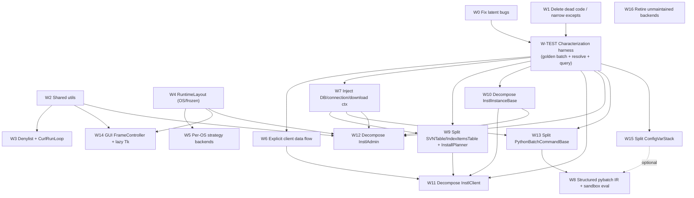

# instl — Refactoring Roadmap

> ## Status (branch `download-enhancements-cont`)
>
> This roadmap is **mostly not executed**. What has actually landed:
>
> - **Dead-code / swallowed-exception hygiene** across pybatch, configVar/aYaml, utils,
>   db+svnTree and pyinstl-core (W1).
> - **A characterization net** under `tests/characterization/` — pybatch serialization,
>   configVar resolution, and InstlClient copy/graph-resolution goldens.
> - **A typed `config_vars` accessor seam**, `configVar/accessors.py`, used from
>   `instlDoIt`, `instlInstanceBase` and `instlMisc`, plus the consolidation of three
>   duplicate sets of private typed readers into it (part of W7).
> - **Documentation-only hardening** of the pybatch serialization backbone (W8 §8);
>   emitted output is byte-identical.
> - **Download-subsystem extractions** driven by this branch's own work rather than by
>   this roadmap: curl orchestration out of the pybatch commands into
>   `pyinstl/downloadTransfer.py`, and verify/redownload machinery out of
>   `pybatch/info_mapBatchCommands.py` into `pyinstl/downloadVerify.py`.
>
> **Attempted and reverted.** The three god-object *package splits*
> (`instlAdmin`/`instlClient`/`instlGui` → `pyinstl/admin/`, `pyinstl/client/`,
> `pyinstl/gui/`, each composed from 7–8 private mixins behind a re-export shim) landed
> and were then reverted in full. The three modules are byte-identical to master again
> and the packages no longer exist. The stated reason: the mixins all shared one `self`,
> so nothing became isolatable or independently testable — the runtime object stayed a
> god object spread across eight files — and the seams were not real (`sort_all_items_by_target_folder`
> had to stay in the composed class because `self.__all_iids_by_target_folder` name-mangles).
> **Any future attempt at W11/W12/W14 should extract named collaborators with real
> boundaries, not mixins over a shared `self`.**
>
> **Not started:** W2, W3, W4, W5, W6, W9, W10, W13, W15, W16, the structured-IR half of
> W8, and the DB/connection/download-context half of W7.
>
> **Verification setup.** Tests are stdlib `unittest` (pytest is not used and not a
> requirement). Run from the repo root under the Python 3.12 venv:
> `venv/Scripts/python.exe -m unittest discover -s . -p "test_*.py" -t .`. The
> characterization goldens and the `configVar`/`pybatch` suites pin behavior and must
> keep passing. The `DOWNLOAD_*` flags in `defaults/InstlClient.yaml` are deliberately
> untouched by roadmap work.

A sequenced, dependency-aware plan that turns the six themes in
[`ARCHITECTURE.md` §6](./ARCHITECTURE.md) into concrete, ordered workstreams.

This document builds **on** the existing maps and does not re-derive them:

- [`ARCHITECTURE.md`](./ARCHITECTURE.md) — layering, dependency graph, runtime flows, and §6 "Architectural Pain Points & Refactoring Themes".
- [`HLD.md`](./HLD.md) — per-subsystem responsibility / interface / state / "design notes & constraints".
- [`LLD.md`](./LLD.md) — per-subsystem "refactoring notes" with exact file/line citations.

Wherever this roadmap names a fix, the authoritative location is the LLD note it
references. The themes are abbreviated below as **T1**–**T6**:

- **T1** God-objects / mixed concerns
- **T2** Global mutable singletons / hidden coupling
- **T3** `eval`/`exec` on supplied input & repr→eval serialization
- **T4** Scattered, duplicated platform branching
- **T5** Duplicated logic & near-duplicate code paths
- **T6** Dead code, swallowed exceptions, latent bugs

---

## 1. Goals & Guardrails

### What "more streamlined and effective" means here

1. **Shrink the blast radius of change.** Today a change to `PythonBatchCommandBase`
   or `InstlInstanceBase` ripples into every command; a schema change to the index
   tables silently breaks `SVNTable`. Success = a localized change stays local.
2. **Make the choke points testable in isolation.** The two download choke points
   (URL sync planning, checksum-verify redownload), `up2s3_repo_rev`, and the
   client copy/sync pipeline should be exercisable without live S3/Redis/SVN and
   without relying on `reset_*`/`clear()` global hygiene between tests.
3. **Contain global mutable state.** `config_vars`, `DBManager` class-level tables,
   `ConnectionBase.repo_connection`, the `download*` singletons, and pybatch's
   class-level progress/stage state should be injected or scoped, not reached for.
4. **Reduce the `eval`/`exec` surface** to a known, whitelisted, structured form.
5. **Delete dead weight and fix the enumerated latent bugs** so the codebase stops
   lying about what it does.

### Non-negotiables (do not break these)

- **The YAML input contract.** `defaults/main.yaml`, `defaults/compile-info.yaml`,
  per-subclass `*.yaml` defaults, user config YAML, the index/require YAML tags
  (`!define`, `!define_if_not_exist`, `!include`, `!index`, `!index_<OS>`, `!require`,
  `!+=`), and the `$(NAME<params>[index])` resolution mini-language must keep
  resolving identically. ConfigVar/aYaml refactors are internal only.
- **CLI behavior.** Every command name, option token, exit code, and the
  `init_from_cmd_line_options → do_command → close` lifecycle stay byte-compatible.
  The generated batch `.py` script must remain runnable by the same launcher.
- **Cross-platform.** Mac / Win / POSIX behavior is preserved exactly. Centralizing
  platform branching (T4) must be behavior-preserving — same `chmod`/`chown`/`chflags`,
  same path/launch resolution, same Win short-path workarounds.
- **The plan→emit→run two-phase model.** The `repr`→eval round-trip is the backbone;
  T3 work must keep producing a re-runnable artifact (old scripts must still run).
- **Admin/S3/Redis pipeline output.** `up2s3` / `up-short-index` / `activate-repo-rev`
  must produce identical S3 layouts, repo-rev files, and Redis keys.

### Constraints from the download subsystem

> **The `download*` family is actively developed on this branch** — `downloadState`,
> `downloadRetry`, `downloadObservability`, `downloadEvents`,
> `downloadFailures`, `downloadControlChannel`, `downloadTransfer`,
> `downloadVerify`. Its wire contract is co-designed with Waves Central (see
> `docs/download-events.md` and `Central/download-system-enhancement/`), so the contract is a
> constraint, not a suggestion. Any workstream that edits these modules (**W2**, **W3**, **W7**)
> carries the specific hazards below.
>
> - **W7.** The singletons W7 would wrap in a `DownloadContext` — `_GLOBAL_CHANNEL` /
>   `get_global_channel()` in `downloadControlChannel.py`, `_active_observability` in
>   `downloadObservability.py`, `_telemetry_enabled` / `set_telemetry_enabled` in
>   `downloadEvents.py`, `CUrlHelper.cached_internal_parallel` — are load-bearing for rollout.
>   `set_telemetry_enabled()` in particular is the telemetry kill switch driven by
>   `DOWNLOAD_TELEMETRY_ENABLED`; rewiring it removes the rollout hatch.
> - **W3.** The "single privacy denylist" must preserve **both** redaction paths. The denylist is
>   deliberately built independently at each source — `downloadEvents._DISALLOWED_EVENT_FIELDS`
>   and `downloadRetry.format_retry_decision_log_line` — and the legacy `DOWNLOAD_RETRY_DECISION`
>   line is intentionally kept separate from `DOWNLOAD_EVENT` for backward compatibility. A
>   careless merge risks a telemetry leak. (The two sets differ only in that the events copy also
>   drops `localPath`/`downloadPath`.) Merging the two curl run loops additionally churns the
>   per-entry range-resume / byte-zero-fallback curl configs the resume path depends on. Note the
>   `_run_fallback_after_curl_range_failure` pair is **out of scope** — it is deliberately not
>   shared, and a comment at each site records that.
> - **W2.** The shared atomic-JSON-write / UTC-ISO-timestamp helper is behavior-preserving but
>   still edits every active `download*` module.
>
> **Flag-state caveat (do not "fix" as a bug).** `defaults/InstlClient.yaml` ships
> `DOWNLOAD_CENTRAL_UX_ENABLED: yes` and `DOWNLOAD_RESUME_ENABLED: yes` — both on by default.
> Whether to re-gate them is a release decision — none of W0/W1 should silently "correct" them.

---

## 2. Guiding Principles

1. **Characterization tests before structural change.** Before splitting a
   god-object, capture its current observable output. The cheapest characterization
   harness in this codebase is **golden batch-script comparison**: run a command
   with `--out plan.py` (without `--run`) and diff the emitted script. This pins
   the behavior of the whole client/admin pipeline without touching the filesystem.
   For ConfigVar, golden-resolve a corpus of `$()` strings. For the DB layer, golden
   the row sets of the heavy SQL queries.
2. **Shrink global `config_vars` coupling before splitting god-objects.** Most
   god-objects (`InstlClient`, `InstlAdmin`, `InstlInstanceBase`) pass data between
   methods *implicitly through config-var keys* and use them as a status channel
   (LLD client note 4, admin note 3). You cannot cleanly extract a collaborator
   while its inputs/outputs are invisible global writes. Make the data flow explicit
   first, then extract.
3. **One seam at a time.** Each workstream cuts exactly one seam (e.g. extract
   `PathResolver`, or split the reader from `SVNTable`), lands behind green
   characterization tests, and ships before the next begins. No "big bang" rewrites.
4. **Quick wins are independent and ship first.** T6 bug fixes and dead-code deletion
   have no prerequisites and de-risk everything downstream (a fix to `SVNRow.__eq__`
   or the `needs()` set/append bug must not be entangled in a structural PR).
5. **Prefer composition over the inheritance root.** `InstlInstanceBase` is the root
   of all five command classes; new collaborators are *composed in*, not added to the
   base, so concerns stop being forced onto every command.
6. **Keep singletons as thin defaults.** When injecting a dependency (DB, connection,
   download context), leave the existing global accessor in place delegating to the
   injected instance, so callers migrate incrementally.
7. **Never change behavior and structure in the same commit.** Bug fixes (T6) are
   their own commits with their own tests; pure moves are behavior-preserving.

---

## 3. Refactoring Backlog (prioritized)

Effort: S ≈ ≤1 day, M ≈ 2–4 days, L ≈ 1–2 weeks. Payoff and Risk are relative.
**Status** reflects branch `download-enhancements-cont` (✅ DONE / 🟡 PARTIAL / ⏸ NOT STARTED / ↩ REVERTED).

| ID | Title | Theme | Status | Risk | Effort | Payoff |
|----|-------|-------|--------|------|--------|--------|
| **W0** | Fix enumerated latent bugs | T6 | 🟡 **PARTIAL** — fixed: `log.wanging` typo, `get_disk_free_space`'s unimported `win32file`. Still present: `needs` set/append, the missing-`f` f-string in `baseClasses.log_result`, `IsSymlink.repr_own_args`, `SVNRow.__repr__` (only its first line is f-prefixed) and `SVNRow.__eq__` (omits `needed_for_iid`), boto's unimported `os`, `verbatim=source_url==['url']` always-False, deprecated Redis `hmset`, swallowed `OperationalError`. | Low | S–M | High |
| **W1** | Delete dead code & narrow `except: pass` | T6 | ✅ **DONE** — per-package hygiene sweeps: pybatch `3bc5462e`, configVar/aYaml `e52dcc36`, utils `ac30de3c`, db/svnTree `6e59eacc`, pyinstl-core `e712c3f4`. | Low | M | Med–High |
| **W2** | Shared util consolidation (atomic-JSON write, UTC-ISO timestamp, `run_instl_subprocess`, detail-query builder) | T5 | ⏸ **NOT STARTED** — the config-var coercion part of this is done (`configVar/accessors.py`); the rest is untouched. | Low | M | High |
| **W3** | Single privacy denylist + one curl run loop | T5 | ⏸ **NOT STARTED** — the denylist is still defined twice (`downloadEvents` / `downloadRetry`); the two run loops now sit side by side in `downloadTransfer` but are not merged. See the constraint note below before merging either. | Med | M | High |
| **W4** | `RuntimeLayout`: centralize OS/frozen detection | T4 | ⏸ **NOT STARTED** — OS-identity reads are routed through `configVar/accessors.py` (`current_os`/`target_os`) as a precursor. | Med | M | Med–High |
| **W5** | Per-OS strategy backends (Permission/Flag) | T4 | ⏸ **NOT STARTED** (depends on W4). | Med | M–L | Med |
| **W6** | Explicit data flow out of `config_vars` in client pipeline | T2/T1 | ⏸ **NOT STARTED** — the `InstallPlan` dataclass return change is not done; the typed-accessor seam (W7) is the landed precursor. | Med | M | High |
| **W7** | Inject DB / connection / download context; typed `config_vars` accessors | T2 | 🟡 **PARTIAL** — `configVar/accessors.py` added, call sites in `instlDoIt`/`instlInstanceBase`/`instlMisc` routed through it, and three duplicate sets of private typed readers folded into its `config_var_str`/`_bool`/`_int`/`_list`. DB / connection / download-context injection remains. | High | L | High |
| **W8** | Structured pybatch IR + registry deserializer; sandbox `eval` | T3 | 🟡 **PARTIAL** — serialization backbone *hardened and documented* (invariants in-code, sharp edges + migration path in §8), **output byte-identical** (`c9a036a6`). The IR migration / eval-sandboxing itself remains deferred. | High | L | High |
| **W9** | Split `SVNTable` & `IndexItemsTable`; add `InstallPlanner` coordinator | T1/T2 | ⏸ **NOT STARTED** (`svnTree/svnTable.py` is 1620 lines, cross-table joins intact). | High | L | High |
| **W10** | Decompose `InstlInstanceBase` into collaborators | T1 | ⏸ **NOT STARTED** — `PathResolver`/`BatchFileWriter`/`DependencyAnalyzer` not extracted. | High | L | High |
| **W11** | Decompose `InstlClient` | T1 | ↩ **REVERTED** — a `pyinstl/client/` mixin package landed and was reverted; `instlClient.py` is byte-identical to master (660 lines). Named collaborators (calculation / sync-location / require-file, `InstallPlan`) remain unstarted. | High | L | Med–High |
| **W12** | Decompose `InstlAdmin` into command clusters | T1 | ↩ **REVERTED** — a `pyinstl/admin/` mixin package landed and was reverted; `instlAdmin.py` is byte-identical to master (1481 lines). Named `RepoMaintenance`/`StageSync`/`Wtar`/… collaborators remain unstarted. | High | L | High |
| **W13** | Split `PythonBatchCommandBase` (serialize vs execute) | T1/T2 | ⏸ **NOT STARTED** — backbone documented in W8 §8; the mixin split itself is not done. | High | L | Med–High |
| **W14** | Decompose GUI `FrameController`; lazy `Tk()` | T1/T4 | ↩ **REVERTED** — a `pyinstl/gui/` package landed and was reverted; `instlGui.py` is byte-identical to master (984 lines) and the Tk root is still created at import time. | Med | M | Med |
| **W15** | Split `ConfigVarStack` (container / resolver / dumper / OS-rewrite) | T1/T2 | ⏸ **NOT STARTED**. | High | L | Med |
| **W16** | Retire/quarantine unmaintained backends (SVN/P4/BOTO, `dockutil`) | T5/T6 | ⏸ **NOT STARTED**. | Low | S–M | Med |

> Additional landed work not enumerated above: **modernization** — `pipes`→`shlex` and
> other safe py3.13-compat / idiom wins (`ebfb23d3`); **client error hardening** — clearer,
> actionable install-path error/failure messaging (`9378cef6`); and the
> **characterization net** itself (see W-TEST below).
>
> W2, W3 and W7's download-context step touch the actively-developed `download*` / curl paths;
> see "Constraints from the download subsystem" in §1 before starting any of them.

---

## 4. Dependency-Ordered Sequencing

### Why this order

The ordering is driven by three hard prerequisites:

1. **You cannot safely split a god-object until its global coupling is contained
   and characterization tests exist.** Concretely: `InstlAdmin` (W12) and
   `InstlClient` (W11) pass data between steps through `config_vars` and use it as a
   status channel (LLD admin note 3, client note 4). Splitting them while that data
   flow is invisible would silently drop state. So **W6** (make client data flow
   explicit) precedes **W11**, and the admin status-channel cleanup (folded into
   **W2/W7**) precedes **W12**.
2. **Everything structural must sit behind characterization tests.** **W-TEST**
   (golden batch-script + golden-resolve + golden-query harness) is a prerequisite
   edge into *every* structural workstream (W6–W15). It is cheap because the system
   already emits a deterministic `.py` plan when run without `--run`.
3. **Bug fixes and dead-code deletion must land first** so they aren't entangled in
   moves. **W0/W1** have no prerequisites and reduce noise for the golden tests
   (e.g. fixing `SVNRow.__eq__`/`__repr__` in W0 is a precondition for trusting
   golden DB-row diffs in W9).

Further edges:

- **W7 (inject DB/connection/download context) is the spine of T2** and gates the
  god-object splits that need to *hold* those dependencies rather than reach for
  globals: `SVNTable`/`IndexItemsTable` (W9) and `PythonBatchCommandBase` (W13)
  both consume injected DB/run-context.
- **W2 (shared utils) precedes W3** (the single denylist and CurlRunLoop reuse the
  consolidated helpers) and precedes the GUI split **W14** (which uses the new
  `run_instl_subprocess`).
- **W4 (RuntimeLayout) precedes W5** (per-OS strategy backends are selected by the
  layout) and feeds **W14** (GUI platform checks) and **W12** (admin OS gating).
- **W8 (structured IR) depends on W13's serialize/execute split** being at least
  started, because the IR is the structured form of what `repr` emits today.
- **W16 is independent** and can land any time after W0/W1.

### Mermaid prerequisite graph



Solid edges are hard prerequisites; the dotted edge (W15→W8) is a convenience, not a
blocker. W16 has no incoming edges beyond W0/W1 and is omitted from the chains.

### Suggested waves — and what actually landed

- **Wave A (de-risk, no prerequisites):** W0, W1, W16, and stand up **W-TEST**.
  → **Largely DONE.** W-TEST stood up first (`c9c17223`, then the instlClient copy/graph
  goldens `d8efde3e`); W1 hygiene completed across all packages; W0 fixed some of the enumerated
  bugs (see its row in §3 for what is still open). W16 not done.
- **Wave B (foundations):** W2, W3, W4, W5, W6, W7.
  → **PARTIAL.** The non-download, non-DB half of W7 landed as the typed `config_vars`
  accessor seam (`configVar/accessors.py`). W2/W3/W4/W5/W6 not started.
- **Wave C (structural cuts):** W9, W10, W13, W15.
  → **NOT DONE** (these are the deep class-level decompositions).
- **Wave D (depends on C):** W11, W12, W14, W8.
  → **REVERTED / PARTIAL.** W11/W12/W14 were attempted out of order as mixin packages behind
  re-export shims and then reverted in full (see the status block at the top). W8's serialization
  backbone was *hardened and documented* (§8) without changing output.

> **What the reverted attempt showed.** The plan's hard edge — finish Wave C (collaborator
> extraction) before Wave D (god-object decomposition) — was relaxed on the theory that splitting a
> god-object into a package of mixins behind a shim is behavior-identical, testable against the
> goldens, and de-risks the file. It was behavior-identical, but it did not decompose anything: the
> mixins shared one `self`, so no part became independently testable, and one method had to stay in
> the composed class because a name-mangled private attribute could not be reached from a
> differently-named mixin. **The original ordering stands** — extract the class-level collaborator
> seams (`PathResolver`, `InstallPlan`, `InstallPlanner`, serialize/execute) first; a file-layout
> split on its own buys nothing.

> **Download-subsystem gate.** W3 and the `download*` portion of W7 carry the hazards listed in
> §1 ("Constraints from the download subsystem"). The remaining non-download Wave B parts
> (W4, W5, W6, the DB/connection half of W7) are open.

---

## 5. Per-Workstream Detail (top 6)

The six highest-leverage workstreams. Each lists current state, target state,
concrete steps, verification, and rollback.

### W0 — Fix enumerated latent bugs (T6)

**Current state.** Several small but correctness-affecting bugs documented in the
LLD. Still open: `InstlInstanceBase.needs` calls `.append` on a `set` (raises
`AttributeError` on a missing dependency); `baseClasses.log_result` emits literal
`{...}` braces (missing `f`); `IsSymlink` defines `repr_own_args` instead of
`__repr__`, breaking `repr(If(IsSymlink(...)))` (`conditionalBatchCommands.py`);
`SVNRow.__eq__` omits `needed_for_iid` and `SVNRow.__repr__` f-prefixes only its
first line so the rest renders literally (`svnTable.py`);
`instlInstanceSync_boto.py` uses `os.fspath` without `import os`;
`instlInstanceSync_url.py` `verbatim=source_url==['url']` is always False;
`instlAdmin.py` uses removed `hmset`; `dbMaster.py` swallows `OperationalError` as
success. Already fixed on this branch: `removeBatchCommands.py`'s `log.wanging`
typo and `files.py`'s unimported `win32file`.

**Target state.** Each bug fixed with a focused regression test; no behavior change
elsewhere.

**Concrete steps.** One commit per bug (or per tight cluster), each with a test that
fails before and passes after. Start with the ones that unblock characterization
tests: `SVNRow.__eq__`/`__repr__` (trustworthy DB-row goldens), the `needs()` fix
(dependency-query goldens), the `dbMaster` transaction fix (so swallowed failures stop
masking).

**Verify.** New unit tests; full existing test suite green; golden batch scripts for a
representative `copy`/`sync` unchanged (these bugs are off the happy path, so goldens
should not move — if they do, investigate).

**Rollback.** Each is an isolated commit; revert individually.

### W1 — Delete dead code & narrow swallowed exceptions (T6)

**Current state.** `if False:` blocks, no-op stubs (`text_with_color`,
`teardown_file_logging` unreachable body), dead helpers (`find_leaves`,
`can_skip_unwtar`, `_option_1` ~60 dup lines in uninstall), always-false debug flags
(`skip_some_actions`, `total_redundant_wtar_files`), duplicated imports
(`baseClasses.py`), and broad `except: pass` in `should_wtar`,
`do_translate_guids`, `extract_info`, the Redis heartbeat thread, and GUI
activate/upload.

**Target state.** Dead code removed; every remaining `except` catches a specific type
and logs (`log.warning`/`log.exception`) instead of silently passing.

**Concrete steps.** (1) Delete dead blocks/flags/imports/helpers, compiling after each
group. (2) For each swallow site, replace `except: pass` with the narrowest exception
type plus a log line; keep the swallow only where genuinely best-effort and document
why. (3) Remove `_option_1` and confirm `InstlClientUninstall` still uses the live
algorithm.

**Verify.** Suite green; `grep -rn "except.*: *pass"` count drops; golden scripts for
`copy`/`sync`/`uninstall`/`up2s3` unchanged. Manually confirm uninstall reference
counting still matches goldens after `_option_1` removal.

**Rollback.** Per-group commits; revert the offending group. Dead-code deletion is
inherently reversible via git.

### W6 — Explicit client data flow out of `config_vars` (T2/T1)

**Current state.** `InstlClient.calculate_install_items` and friends round-trip
results through `__*__` config keys (`instlClient.py`), and
`InstlClientUninstall` mutates `req_trans['status']` in place
(`instlClientUninstall.py`). Downstream `do_copy`/`do_remove` read those keys
back. Data flow is order-dependent and invisible (HLD client note: "Calculation
results are passed between methods implicitly through config-var keys").

**Target state.** Calculation methods **return explicit structures** (e.g. a
`InstallPlan` dataclass carrying the IID lists, per-folder bookkeeping, and
sync-location map). `config_vars` keys that other subsystems genuinely consume
(e.g. `__FULL_LIST_OF_INSTALL_TARGETS__`) are written *once* from the explicit result,
not used as the primary channel. Require-translate rows are treated as immutable input.

**Concrete steps.** (1) Identify every `config_vars[...]` write in the calculate path
and every reader (grep `__FULL_LIST_OF_INSTALL_TARGETS__`, etc.). (2) Introduce the
return dataclass; have `calculate_install_items` populate and return it. (3) Thread it
through `do_copy`/`do_remove`/`do_uninstall` as a parameter. (4) Keep the public
config-var keys as a thin write-through at the boundary so anything outside the client
(reports, batch assignment) is unaffected. (5) Stop mutating `req_trans` in place.

**Verify.** Golden batch scripts for `copy`, `synccopy`, `remove`, `uninstall`
**identical** before/after — this is the whole point of the characterization harness.
Plus targeted unit tests on the new dataclass.

**Rollback.** The write-through boundary means the external contract never changed; if
goldens diverge, revert the threading commit and the dataclass is dead code.

### W7 — Inject DB / connection / download context (T2)

**Current state.** `DBManager` exposes `db`/`info_map_table`/`items_table` as
class-level descriptors with a `reset_db()` hook "precisely to fight" their global
nature (LLD DB note 10). `ConnectionBase.repo_connection` is a process-wide,
non-resettable singleton (sync note 6). The `download*` family keeps `_GLOBAL_CHANNEL`,
`_active_observability`, `_telemetry_enabled`, and `CUrlHelper.cached_internal_parallel`
as module globals needing `reset_*` hooks (download note 9). pybatch holds run-scoped
progress/stage state at class level (`baseClasses.py`), breaking `RunInThread`
reentrancy.

**Target state.** A per-run **session/context object** owns the DB handle, the
connection, and the download context, and is threaded through the choke points. The
existing globals remain as thin defaults delegating to the current session, so callers
migrate incrementally.

> ⚠️ **Sequence the `download*` part LAST.** The download singletons named here
> (`get_global_channel()`/`_GLOBAL_CHANNEL`, `_active_observability`,
> `_telemetry_enabled`/`set_telemetry_enabled`, `CUrlHelper.cached_internal_parallel`) are the
> exact surfaces the download work is still building on. `set_telemetry_enabled()` in particular
> is the telemetry kill switch driven by `DOWNLOAD_TELEMETRY_ENABLED`, so wrapping it in a
> `DownloadContext` removes the rollout hatch. The DB/connection injection (steps 1–3,
> 5 below) is safe to start independently; **step 4 should come last**.

**Concrete steps.** (1) Define `RunContext` (or reuse `InstlInstanceBase` as the
owner) holding `db`, `connection`, `download_ctx`. (2) Convert `DBManager` descriptors
to read from the instance's context, leaving the class-level accessor as a default.
(3) Replace `connection_factory`'s module singleton with a context-held connection +
explicit reset/lifecycle hook. (4) Wrap the four `download*` singletons in a
`DownloadContext` passed through `CUrlHelper.create_download_instructions` and
`CheckDownloadFolderChecksum`; keep `get_global_channel()` as the default. (5) Move
pybatch run-scoped progress/stage into a run object (or thread-local) for the
serialize/execute path.

**Verify.** Golden batch scripts unchanged. Add a test that runs two `InstlClient`
instances in the same process (or interactive client+admin) without cross-contamination
— previously impossible without `reset_*`. Confirm `reset_*` test hooks can be deleted.

**Rollback.** Because globals stay as delegating defaults, partial rollback is safe:
revert any single subsystem's injection while the others keep using the context.

### W9 — Split `SVNTable` / `IndexItemsTable`; add `InstallPlanner` (T1/T2)

**Current state.** `svnTree/svnTable.py` is 1620 lines mixing parsing, bulk insert,
query helpers, `mark_*`/`ignore_*`, sync-folder diffing, URL policy, and serialization.
`IndexItemsTable` is similarly broad. The two "separate" tables are coupled: SVNTable
methods (`mark_required_files_for_active_items`, `populate_IIDToSVNItem`,
`set_info_map_file`, `get_files_that_should_be_removed_from_sync_folder`) join
`index_item_detail_t`/`iid_to_svn_item_t` directly, so a schema change to the index
tables silently breaks SVNTable (DB notes 2–4).

**Target state.** SVNTable → `SVNInfoMapReader`/`SVNInfoMapWriter`, `SVNQuery`,
`SVNMutator`, and a small URL resolver, all over the same `DBMaster`. IndexItemsTable →
`IndexYamlReader`/`RequireYamlReader`, `IndexItemQuery`, `InheritanceResolver`, and a
reporting collaborator. Cross-table joins move into a dedicated `InstallPlanner`
coordinator that depends on **both** tables, so neither table reaches into the other.

**Concrete steps.** (1) Land W0's `SVNRow` `__eq__`/`__repr__` fix first (trustworthy
goldens). (2) Build `SVNRow` from `sqlite3.Row` by column name (DB note 8) to break the
`SELECT *` positional coupling — prerequisite for safely moving queries. (3) Introduce
the parametrized detail-query builder (shared with W2) to collapse the ~10 duplicated
SELECTs. (4) Extract the reader/writer first (lowest coupling), then query, then
mutator. (5) Move the four cross-table joins into `InstallPlanner`. (6) Standardize
IN-list quoting on bound placeholders (DB note 6).

**Verify.** Golden **row sets** for `mark_required`, `mark_need_download`,
`resolve_inheritance`, and sync-folder diff — captured before any move. Golden batch
scripts for `sync`/`copy` unchanged. The injected-DB work (W7) must already be in so
the new collaborators receive `DBMaster` rather than reaching for the class descriptor.

**Rollback.** Each extracted collaborator is introduced behind the existing public
method signatures of `SVNTable`/`IndexItemsTable` (facade), so the call sites are
untouched; revert an extraction without touching callers.

---

## 6. Target Module / Package Layout (before → after)

> **Status note.** Nothing in this section has landed. Each of the three god-objects is a single
> module, byte-identical to master: `pyinstl/instlAdmin.py` (1481 lines), `pyinstl/instlClient.py`
> (660), `pyinstl/instlGui.py` (984). A mixin-package split of all three landed earlier on this
> branch and was reverted in full (see the status block at the top); the layouts below were **not**
> what it produced, and remain the target for the deeper W9–W14 extraction — domain collaborators
> with real boundaries, not mixins sharing one `self`.

### `pyinstl/instlAdmin.py` (~1481 lines) — worst god-object

**Before**
```
pyinstl/instlAdmin.py
  class InstlAdmin(InstlInstanceBase)   # ~10 command clusters, getattr("do_"+name) dispatch
    do_fix_props / do_fix_perm / do_fix_symlinks
    do_stage2svn / stage2svn_with_comparator / do_svn2stage
    prepare_conditions_for_wtar / should_wtar / do_wtar_staging_folder
    do_verify_index / do_verify_repo (+ helpers)
    do_up2s3 / up2s3_repo_rev
    do_up_short_index / up_short_index_repo_rev    # dup scaffolding of up2s3_repo_rev
    do_activate_repo_rev
    do_wait_on_action_trigger (+ heartbeat, inline trigger dict)
    do_collect_manifests (ManifestItem/ManifestYamlReader defined *inside* the method)
    misc utilities; inline redis.Redis(...) / boto3.resource('s3')
  module fns: start_redis_heartbeat_thread, smart_merge_dicts, dict_in_canonical_order
```

**After**
```
pyinstl/admin/
  __init__.py            # InstlAdmin thin shell: holds command registry, dispatch, shared ctx
  repo_maintenance.py    # fix_props / fix_perm / fix_symlinks (Mac Icon\r quirk -> pybatch cmd)
  stage_sync.py          # stage2svn / svn2stage + comparator
  wtar.py                # prepare_conditions_for_wtar / should_wtar / do_wtar_staging_folder
  verification.py        # verify_index / verify_repo
  s3_upload.py           # up2s3_repo_rev + up_short_index_repo_rev
                         #   share _repo_rev_upload_session(status_var, exception_var, template) CM
  activation.py          # activate_repo_rev
  redis_daemon.py        # wait_on_action_trigger + heartbeat + validated trigger registry
  manifests.py           # ManifestItem, ManifestYamlReader (hoisted), collect_manifests
  clients.py             # lazy cached self._redis() / self._s3() accessors (no inline construction)
```

### `pyinstl/instlGui.py` (~984 lines)

**Before**
```
pyinstl/instlGui.py
  Tk() at import time (module global)
  CreateTkConfigClass -> TkConfigVarStr/Int/Bool
  FrameController                       # UI + dialogs + subprocess + stderr parse + clipboard
  ClientFrameController / AdminFrameController / ActivateFrameController
                                        # 4 duplicated spawn+platform branches; read_*_config_files dup
  InstlGui(InstlInstanceBase)
  admin_command_template_variables
```

**After**
```
pyinstl/gui/
  __init__.py            # InstlGui: constructs Tk lazily in __init__/do_command (no import-time root)
  tk_config.py           # CreateTkConfigClass + TkConfigVar* bindings
  frame_controller.py    # thin view-controller only
  command_runner.py      # run_instl_subprocess(argv) -> (rc, stderr)  [shared by all tabs, from W2]
  file_ops.py            # file dialogs / fs helpers
  client_tab.py / admin_tab.py / activate_tab.py
                         # activate tab schedules via self.frame.after (no reach into notebook)
  templates.py           # admin_command_template_variables
```

### `pyinstl/instlClient.py` (~660 lines) + `pyinstl/instlInstanceBase.py` (~565 lines)

**Before**
```
pyinstl/instlInstanceBase.py
  InstlInstanceBase   # config load + YAML tags + DB lifecycle + path resolution
                      # + batch gen/run + dependency queries + serialization (root of all 5 commands)
pyinstl/instlClient.py
  InstlClient         # pipeline + DB-status mutation + folder bookkeeping
                      # + sync-location + require.yaml I/O + binary scan + YAML repr (data via config_vars)
  InstlClientSyncCopy # defined inline per synccopy invocation
```

**After**
```
pyinstl/instance/
  base.py                # InstlInstanceBase: thin lifecycle shell, composes the collaborators below
  path_resolver.py       # PathResolver: calc_user_cache_dir_var / get_aux_cache_dir /
                         #   get_default_sync_dir / relative_sync_folder_* (uses RuntimeLayout from W4)
  batch_file_writer.py   # BatchFileWriter: create_variables_assignment / init_python_batch /
                         #   write_batch_file / run_batch_file
  dependency_analyzer.py # DependencyAnalyzer: needs / needed_by / find_cycles / verify_actions

pyinstl/client/
  client.py              # InstlClient: thin orchestrator
  install_plan.py        # InstallPlan dataclass (explicit calculation result, from W6)
  sync_locations.py      # set_sync_locations_for_active_items
  require_file.py         # require.yaml read/write/lifecycle
  synccopy.py            # InstlClientSyncCopy promoted to a real module/class
```

(The `InstallPlanner` coordinator from W9 lives in `pyinstl/db/` or `pyinstl/planning/`
and is consumed by `InstlClient`.)

---

## 7. Quick Wins vs. Long-Haul

### Quick wins (low risk / high payoff, no structural prerequisites)

These can land immediately and in parallel; ship them first to de-risk the rest.
(Status is annotated below.)

- **W0** — fix the enumerated latent bugs (each a small, isolated commit + test). 🟡 the
  golden-surfaced ones are fixed (`8b4a9e17`).
- **W1** — delete dead code; narrow `except: pass` to typed-and-logged. ✅ done across all packages.
- **W2** — consolidate atomic-JSON write, UTC-ISO timestamp, config-var coercion,
  `run_instl_subprocess`, and the detail-query builder.
- **W3** — single privacy denylist (prevents silent telemetry divergence) and one
  `CurlRunLoop` shared by both curl drivers (prevents behavior drift).
- **W16** — retire/quarantine the unmaintained SVN/P4/BOTO backends and `dockutil`
  (delete dead `have_boto` path; drop the abstract decorator on `ConnectionHTTP.translate_url`).
- **Stand up W-TEST** — the golden batch-script / golden-resolve / golden-query
  harness. ✅ **DONE** — landed first under `tests/characterization/`
  (`test_pybatch_serialization_golden.py`, `test_configvar_resolution_golden.py`,
  `test_instlclient_copy_golden.py`); initial set `c9c17223`, client copy/graph goldens
  `d8efde3e`. These pin behavior for every structural change below and must keep passing.

### Long-haul (structural; behind characterization tests, sequenced)

These change object structure and must each sit behind green goldens, one seam at a time.

- **W7** — inject DB / connection / download context (the T2 spine).
- **W6** — make client calculation data flow explicit (prerequisite for W11).
- **W9** — split `SVNTable`/`IndexItemsTable`, add `InstallPlanner`.
- **W10** — decompose `InstlInstanceBase` into `PathResolver` / `BatchFileWriter` /
  `DependencyAnalyzer`.
- **W11** — decompose `InstlClient` (depends on W6, W9, W10).
- **W12** — decompose `InstlAdmin` into command-cluster collaborators (depends on
  W2, W7; OS gating via W4).
- **W13** — split `PythonBatchCommandBase` into serialize/execute/progress/stage
  collaborators (depends on W7 for run-scoped state).
- **W8** — structured pybatch IR + registry deserializer; sandbox the `eval`/`exec`
  surface (depends on W13; the highest-value security/maintainability payoff, deliberately
  last because it touches the plan→emit→run backbone).
- **W4 / W5 / W14 / W15** — platform centralization (`RuntimeLayout`, per-OS strategy
  backends), GUI decomposition, and the `ConfigVarStack` split; medium payoff,
  sequenced after their foundations.

---

## 8. W8 — pybatch `repr()`→`eval()` serialization backbone: hardening notes

This section is the design note for the highest-risk seam: the emitted `.py` batch
is **Waves Central's runtime contract**. Central runs it via `instl --run` /
`run-process`, which `compile()`+`exec()`s it in-process
(`pyinstl/instlInstanceBase.py:run_batch_file`). The serialized text is byte-pinned by
`tests/characterization/test_pybatch_serialization_golden.py`. The default stance for
this seam is **document, don't change output**.

### 8.1 The contract, restated (invariants)

1. `repr(cmd)` returns `ClassName(<args>)` where `ClassName` is a name exported by
   `pybatch/__init__.py` (the namespace `from pybatch import *` installs in the exec
   frame). `repr(accum)` returns the whole script (prolog + sections + epilog).
2. Round-trip: `obj == eval(repr(obj))` for round-trippable commands (the ones whose
   repr is a constructor call). A handful — `Echo`/`Remark`/`ConfigVarAssign` — emit a
   bare statement (`print(...)`, `# ...`, `config_vars[...] = ...`) and intentionally do
   **not** round-trip to an equal object; that set is pinned as `NON_ROUND_TRIPPING` in
   the golden test.
3. `__init__` only records args (never does work). Argument values are rendered only
   through `utils.quoteme_raw_by_type` → `quoteme_raw_string`, i.e. **raw string
   literals**, so path/user data can never be re-interpreted as code on the eval side.
4. Argument order is positional-first (`repr_own_args`) then non-default kwargs
   (`repr_default_kwargs`), with `None` entries filtered out so an absent optional arg
   emits nothing (no stray comma).

These invariants are now documented in-code on `PythonBatchCommandBase.__repr__`,
`PythonBatchCommandAccum.__repr__`, `pybatch.EvalShellCommand`, and
`utils.quoteme_raw_by_type` (W8 hardening pass — comments/docstrings only, output
verified byte-identical against the goldens).

### 8.2 The eval/exec surface (3 sites) and why it is trusted today

| Site | What is eval'd | Trust source |
| --- | --- | --- |
| `pybatch/__init__.py:EvalShellCommand` | an index `action` string → typed command | Central-generated index |
| `pybatch/conditionalBatchCommands.py:If.__call__` | a stringified `condition` | the emitted script itself |
| `pyinstl/instlInstanceBase.py:run_batch_file` | the whole `.py` batch file | instl wrote it |

All three trust the *provenance* of their input (Central / instl), not a sandbox. The
risk is therefore **supply-chain / tamper**, not arbitrary end-user input.

### 8.3 Latent sharp edges found during this pass (documented, not changed)

- **`EvalShellCommand` passes `locals()` to `eval`.** The action string can therefore
  reference this function's locals (`action_str`, `message`, `retVal`, …). This is wider
  than needed; in practice index actions only reference pybatch class names. Removing
  `locals()` would *narrow* the surface but could change which strings evaluate
  successfully (anything relying on a local name would flip to a `ShellCommand`
  fallback), so it is a behaviour change and is deferred — see migration below.
- **`If.__call__` does `eval(condition_obj)` with the ambient module globals** (no
  explicit namespace), so the condition string resolves against
  `conditionalBatchCommands`'s globals. Same trust model; same deferral.

### 8.4 Safe migration path (future, Central-coordinated)

Do these only behind green goldens, one seam at a time, with Central sign-off because
any output change is a wire-format change for already-deployed clients reading
already-deployed indexes:

1. **Tighten the `EvalShellCommand` eval namespace without changing accepted input.**
   Build an explicit, frozen dict of `{name: class}` from
   `PythonBatchCommandBase.get_derived_class_names()` plus the few helpers actions
   legitimately use, and pass it as the eval globals with an empty locals. Land it
   guarded by a new characterization golden that asserts the *same* set of real-world
   index actions still produce the *same* command objects (and that a probe action which
   references a former local now falls through to `ShellCommand`). If any real action
   regresses, the namespace is widened to include exactly that name — never reverted to
   `locals()`.
2. **Introduce a structured IR + registry deserializer** (the actual W8 deliverable):
   represent each command as `{op, args, kwargs}` and reconstruct via a name→class
   registry lookup + validated kwargs binding, eliminating `eval` for the
   deserialization path. The `repr()` *emitter* can stay byte-identical during the
   transition (emit both the legacy `.py` and the IR side-car), so old clients keep
   working while new clients prefer the IR. Cut over only when the deployed-client floor
   supports the IR.
3. **Only after (2) is the deployed floor**, consider replacing the in-process
   `exec(compiled_py)` in `run_batch_file` with an IR interpreter, removing the last
   `exec` of generated code. This is the largest blast radius and is explicitly last.

Until those land, the emitted `.py` and the three eval/exec sites are **frozen**; treat
the goldens as the spec.
